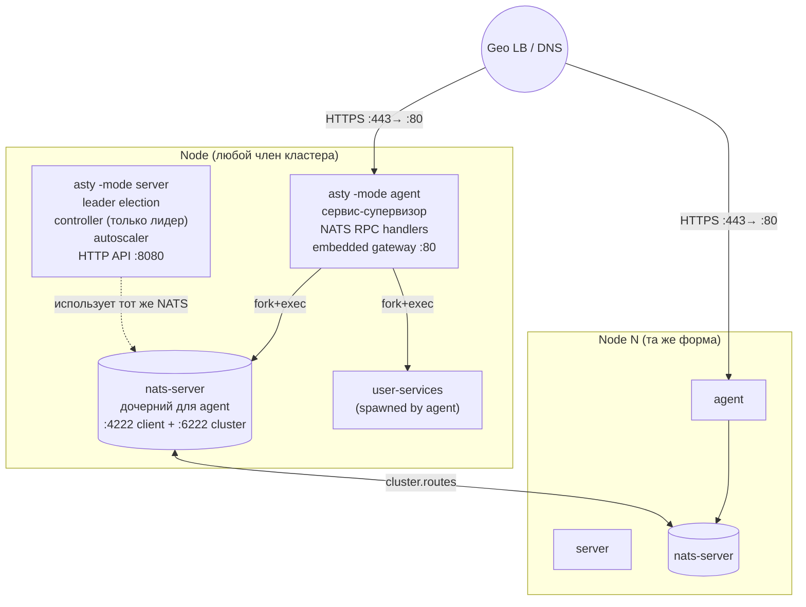
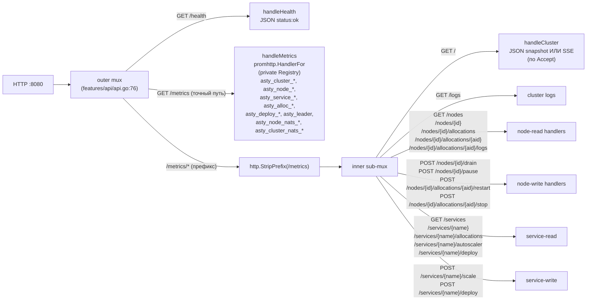
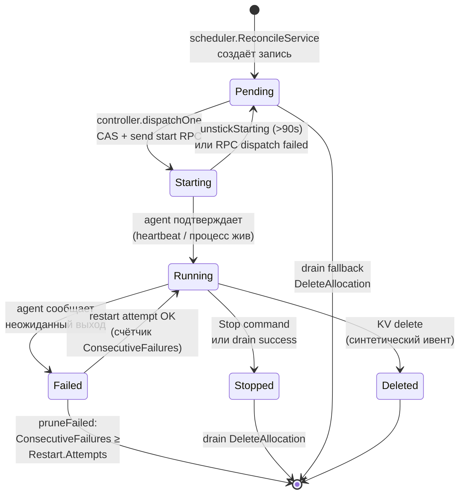
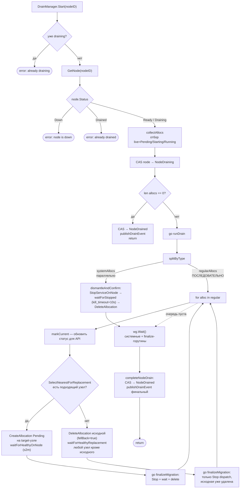
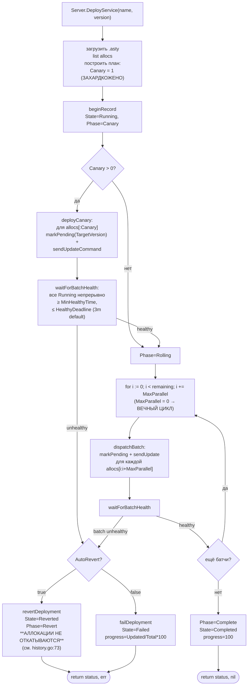

# AS_IS — фактическое состояние Asty

Документ описывает, как код **на самом деле** работает на момент составления
(2026-05-18). Источник истины — выполняемая логика. Имена файлов, функций,
переменных и метрик использовались для ориентации, но проверка велась по
поведению.

Все утверждения подтверждены ссылкой `путь/файл.go:строка`. Что не подтверждено
кодом — здесь не написано.

CLAUDE.md и комментарии расходятся с реальностью в десятках мест; сводка
расхождений — в разделах 9 и 13.

---

## 0. Топология узла

На каждом узле кластера живут два процесса `asty` (server + agent), агент
поднимает локальный `nats-server` как дочерний процесс и встраивает HTTP
gateway. Все узлы соединены `cluster.routes` своих NATS.



Стрелка «leader election» — серверы соревнуются в KV `asty-leader`;
только один сервер активирует controller/scheduler/autoscaler. См. п. 10
про контроллер и `server/leadership.go`.

---

## 1. Точка входа и режимы

`asty/cmd/main.go:24` объявляет флаг `-mode` со значением по умолчанию
`agent`. Допустимые значения, которые код реально различает:

- `agent` — `runAgent` → `agent.New(cfg).Start(ctx)` (`main.go:82`).
- `server` — `runServer` → `server.New(cfg).Start(ctx)` (`main.go:98`).
- `nats-conf` — `renderNATSConf(cfg, peers)` → печатает в stdout содержимое
  `nats.conf`, которое агент собрал бы при старте (`main.go:119`). Этот
  режим пропускает валидацию `cfg.Validate()` (домен/токен), потому что
  предназначен для оффлайн-проверки на частичном dev-конфиге
  (`main.go:52`).

Любое другое значение `-mode` приводит к `log.Fatal` (`main.go:77`).

Флаг `-config` — путь к YAML-конфигу; пусто означает `./config.asty` и
толерантно к отсутствию (`config.Load` пропустит файл и возьмёт только
env + defaults, см. `core/config/load.go`).

Флаг `-peers` принимается только в режиме `nats-conf`.

При установленном `DevMode` (`A_DEV_MODE=true` или `dev_mode: true` в
YAML) код переключает `codec.Wire` и `codec.State` обратно на JSON
(`main.go:67`). Подробности — `core/codec/doc.go`.

### Makefile

`Makefile` фактические цели: `build`, `build-demo`, `build-all`, `clean`,
`test`, `test-integration`, `vet`, `race`, `tidy`, `ci`, `run-agent`,
`run-server`, `fmt`, `lint`, `deps`, `dist`, `nats-server`.

`make nats-server` качает бинарь нужной версии (`NATS_SERVER_VERSION =
2.14.0`, `Makefile:6`) в `bin/`. `make build-all` собирает `bin/asty`,
`bin/xauth`, `bin/xhttp`, `bin/xws` и тянет `nats-server`. `make ci`
прогоняет `build vet race test-integration`.

---

## 2. Супервизия NATS

Файл `asty/internal/agent/natssup.go` отвечает за первичный запуск,
`natswatch.go` — за жизненный цикл.

### Алгоритм загрузки (`bootstrapNATS`, `natssup.go:33`)

1. Найти бинарь `nats-server`: сначала рядом с исполняемым `asty`, затем
   `$PATH` (`findNATSServerBinary`, `natssup.go:168`).
2. Определить IP, на который слушать (`resolveNodeIP`, `natssup.go:91`):
   `cfg.NodeIP`, иначе первый не-loopback IPv4 из интерфейсов.
3. Сгенерировать `nats.conf` (`natsconf.Render`, `core/natsconf/render.go`)
   из `cfg.NATS` + `NodeID` + `NodeIP` + список пиров.
4. Записать на диск в `${workDir}/nats.conf` (`natssup.go:67`).
5. `exec.CommandContext(ctx, binary, "-c", confPath)` → `cmd.Start()`.
   stdout/stderr дочернего процесса наследуются от агента (`natssup.go:48`).
6. TCP-probe `${nodeIP}:${cfg.NATS.Server.Port}` каждые 100 мс до
   30 секунд таймаута (`waitForTCP`, `natssup.go:183`; константы
   `natsBootstrapTimeout`, `natsReadyProbeInterval`).

`renderNATSConf` пишет `cluster{}`-блок **только** если выполняются ОБА
условия (`render.go:54`):

- `cl.Port > 0` (`cfg.NATS.Server.Cluster.Port` задан),
- `len(in.Peers) > 0`.

Если пиров нет, NATS поднимается в standalone-JetStream — это автоматически
даёт `replicas=1` на KV.

```mermaid
flowchart TB
    Start([agent.Start])
    Start --> Boot["bootstrapNATS:<br/>1. findNATSServerBinary<br/>2. resolveNodeIP<br/>3. renderNATSConf (peers, identity)<br/>4. write workDir/nats.conf<br/>5. exec nats-server<br/>6. waitForTCP до 30s"]
    Boot --> Spawn1[go superviseNATS]
    Boot --> Spawn2[go watchNATSPeers]

    Spawn1 --> Sup{superviseNATS<br/>select из 3 событий}
    Sup -->|ctx.Done| StopChild["stopNATSChild:<br/>SIGTERM → ждать 10s → SIGKILL"]
    Sup -->|natsRestartCh| Try{tryHotReloadNATS:<br/>оба conf содержат<br/>cluster{} ?}
    Sup -->|child exited| Fatal([log.Fatal — агент без NATS бессмыслен])
    Try -->|да и conf изменился| Hot[write conf + SIGHUP nats-server<br/>routes-delta живьём]
    Try -->|да но conf равен старому| NoOp[ничего не делать]
    Try -->|нет: standalone↔clustered| Cold[stopNATSChild + bootstrapNATS заново]
    Hot --> Sup
    NoOp --> Sup
    Cold --> Sup
    StopChild --> Exit([return])

    Spawn2 --> Tick[ticker каждые 5s:<br/>resolveNATSPeers,<br/>сортировка, сравнение]
    Tick -->|set отличается| Send["natsRestartCh ← struct{}<br/>buffer=1, drop при заполненности"]
    Send --> Tick
    Tick -.->|ctx.Done| Exit
```

### Watch и SIGHUP (`natswatch.go`)

После загрузки агент запускает две горутины (`agent.go:142-143`):

- `superviseNATS` (`natswatch.go:37`) — единственный владелец
  дочернего процесса. select из трёх событий:
  - `ctx.Done()` → `stopNATSChild` (SIGTERM, ждать
    `natsRestartGrace=10s`, иначе SIGKILL; `natswatch.go:125`).
  - `natsRestartCh` → попытаться `tryHotReloadNATS` (`natswatch.go:80`),
    при провале — холодный рестарт через `bootstrapNATS`.
  - Самопроизвольный выход дочернего процесса → `log.Fatal`. Агент без
    локального NATS бессмыслен (`natswatch.go:67`).
- `watchNATSPeers` (`natswatch.go:145`) — каждые `5s`
  (`natsPeerWatchInterval`, `natswatch.go:20`) пересобирает список пиров,
  сортирует, сравнивает с предыдущим; на расхождение шлёт в
  `natsRestartCh` сигнал (`struct{}{}`), буфер 1.

`tryHotReloadNATS` (`natswatch.go:80`):
1. Рендерит новый conf, читает старый с диска.
2. `natsConfCanHotReload` (`natswatch.go:118`) проверяет, что **обе**
   версии содержат `"cluster {"`. Если хотя бы одна без — переход
   standalone↔clustered, нужен холодный рестарт.
3. Если новый conf побитово равен старому (например, дубликат пира
   добавился и удалился) — возвращает `true` без действий
   (`natswatch.go:94`).
4. Иначе пишет conf на диск, шлёт `SIGHUP`. NATS применяет дельту
   `cluster.routes` живьём.

### Источники списка пиров (`resolveNATSPeers`, `natssup.go:114`)

Порядок: первый источник с непустым значением выигрывает.

1. `A_NATS_PEERS_FILE` — путь к файлу. Парсинг через `splitAndTrim`
   (`natssup.go:144`): разделители — запятая, пробел, табуляция, перевод
   строки. Используется в dev: `start.sh` поддерживает
   `/tmp/asty-dev/peers.txt`.
2. `A_NATS_PEERS` — env, такой же парсинг.
3. `net.LookupIP(cfg.Domain)` — только IPv4 (`natssup.go:133`). Прод.

Self-IP отфильтровывается на выходе (`filterSelf`, `natssup.go:155`).

### Соединения агента с NATS

Их **два**, не три:

- `a.nc` — основное (ASTY, `agent.go:149-156`): команды, KV
  `asty-cluster`, gateway, ping, лог-стримы.
- `a.ncSys` — наблюдательное (SYS, `agent.go:163-173`): только
  `$SYS.REQ.SERVER.*.STATSZ/JSZ`. **Опционально**: если
  `cfg.NATS.ObserverUser` пуст, второе соединение не открывается, а
  метрики `asty_node_nats_*` остаются на нулях.

"Третий" набор учёток (`app_user`/`app_password`) — **не соединение
агента**, а просто значения, которые `exportConfigEnv` (`agent.go:104`)
кладёт в `A_NATS_USER`/`A_NATS_PASSWORD` для дочерних процессов через
`AppCredentials()` (`config/nats.go:131`). Если `app_user` не задан, env
не выставляется вовсе (никакого fallback на креды агента —
комментарий `agent.go:114-118` это явно описывает как defensive choice).

### Реплики JetStream KV

`server/kv.go:autoReplicas` (line 120) считает `len(nc.DiscoveredServers())
+ 1`, ограничено `maxReplicas = 3`.

`ensureKVBucket` (`kv.go:59`) на ошибки 10005 (нет доступных пиров) или
10074 (standalone не поддерживает replicas > 1) уменьшает `replicas` на
1 и пробует снова, пока не дойдёт до 1 (`kv.go:107`).

`watchStreamReplicas` (`streamreplicas.go:43`, **leader-only**) раз в
`streamReplicasInterval = 10s` (`streamreplicas.go:19`) обходит все
стримы JetStream и поднимает `Replicas` через `UpdateStream` к
целевому значению. Только увеличивает — никогда не уменьшает. Целевое
значение для системных стримов (`KV_asty-cluster`, `KV_asty-leader`,
`streamreplicas.go:30`) — `autoReplicas()`. Для пользовательских — то,
что объявлено в `.asty kv[].replicas`, ограниченное снизу
`autoReplicas`.

---

## 3. Конфигурация

### YAML-структура

`Config` (`core/config/config.go:14`):

```
Domain, Datacenter, NodeID, NodeIP, Token, LogLevel    (top-level)
DevMode bool, MockNodes int                            (dev knobs)
NATS      NATSConfig      `yaml:"nats"`
Autoscale AutoscaleConfig `yaml:"autoscale"`
Resources ResourcesConfig `yaml:"resources"`
HTTP      HTTPConfig      `yaml:"http"`
Agent     AgentConfig     `yaml:"agent"`
Gateway   GatewayConfig   `yaml:"gateway"`
```

`Validate` (`config.go:71`) при `DevMode=true` принимает любой конфиг.
Иначе требует `Domain` и `Token`, делегирует `NATS.Validate` и
`Gateway.Validate`.

`NATSConfig` (`core/config/nats.go:21`): главные креды (`user`,
`password`), наблюдательные (`observer_user/password`), прикладные
(`app_user/password`) — три набора. Плюс `Server NATSServerConfig`
с полями `port`, `jetstream`, `cluster`, `accounts`, `system_account`.

`GatewayConfig` (`core/config/gateway.go:11`): `enabled`, `http` (addr +
8 таймаутов), `allowed_hosts []string`, `rate_limit` (rate, burst,
max_ws_conns, trusted_proxy, max_ips). `Validate` пропускает всё, если
`enabled=false` (`gateway.go:46`); иначе требует `rate>0`, `burst>0`,
`max_ips>0`, `max_ws_conns>0`.

### Полный список `A_*`-переменных

`core/config/env.go:14` — `applyEnvOverrides`. Реально читаются:

| ENV | Куда складывается |
|---|---|
| `A_DOMAIN`              | `c.Domain` |
| `A_DATACENTER`          | `c.Datacenter` |
| `A_NODE_ID`             | `c.NodeID` |
| `A_NODE_IP`             | `c.NodeIP` |
| `A_TOKEN`               | `c.Token` |
| `A_LOG_LEVEL`           | `c.LogLevel` |
| `A_DEV_MODE`            | `c.DevMode` (bool) |
| `A_MOCK_NODES`          | `c.MockNodes` (int) |
| `A_NATS_USER`           | `c.NATS.User` |
| `A_NATS_PASSWORD`       | `c.NATS.Password` |
| `A_NATS_OBSERVER_USER`  | `c.NATS.ObserverUser` |
| `A_NATS_OBSERVER_PASSWORD` | `c.NATS.ObserverPassword` |
| `A_NATS_APP_USER`       | `c.NATS.AppUser` |
| `A_NATS_APP_PASSWORD`   | `c.NATS.AppPassword` |
| `A_MIN_COPIES`          | `c.Autoscale.MinCopies` |
| `A_TARGET_CPU`          | `c.Autoscale.TargetCPU` |
| `A_TARGET_MEMORY`       | `c.Autoscale.TargetMemory` |
| `A_TRAFFIC_RPS_THRESHOLD` | `c.Autoscale.TrafficRPSThreshold` |
| `A_TRAFFIC_WINDOW`      | `c.Autoscale.TrafficWindow` |
| `A_COOLDOWN_UP`         | `c.Autoscale.CooldownUp` |
| `A_COOLDOWN_DOWN`       | `c.Autoscale.CooldownDown` |
| `A_EVAL_INTERVAL`       | `c.Autoscale.EvalInterval` |
| `A_DC_LATENCY`          | `c.Autoscale.DCLatency` |
| `A_CONTROLLER_WORKERS`  | `c.Autoscale.ControllerWorkers` |
| `A_RESERVED_CPU`        | `c.Resources.ReservedCPU` |
| `A_RESERVED_MEMORY`     | `c.Resources.ReservedMemory` |
| `A_HTTP_ADDR`           | `c.HTTP.Addr` |
| `A_WORK_DIR`            | `c.Agent.WorkDir` |
| `A_SERVICE_DIR`         | `c.Agent.ServiceDir` |

**Переменной `A_UI_ADDR` в коде нет**. Слушающий адрес HTTP API задаётся
через `A_HTTP_ADDR` (или `http.addr` в YAML, default `127.0.0.1:8080`).

Gateway-секция (`applyGatewayEnv`, `env.go:52`):

| ENV | Поле |
|---|---|
| `A_GATEWAY_ENABLED`              | `g.Enabled` |
| `A_GATEWAY_ADDR`                 | `g.HTTP.Addr` |
| `A_GATEWAY_READ_HEADER_TIMEOUT`  | `g.HTTP.ReadHeaderTimeout` |
| `A_GATEWAY_READ_TIMEOUT`         | `g.HTTP.ReadTimeout` |
| `A_GATEWAY_WRITE_TIMEOUT`        | `g.HTTP.WriteTimeout` |
| `A_GATEWAY_IDLE_TIMEOUT`         | `g.HTTP.IdleTimeout` |
| `A_GATEWAY_NATS_REQUEST_TIMEOUT` | `g.HTTP.NATSRequestTimeout` |
| `A_GATEWAY_NATS_RETRY_DELAY`     | `g.HTTP.NATSRetryDelay` |
| `A_GATEWAY_WS_CONNECT_TIMEOUT`   | `g.HTTP.WSConnectTimeout` |
| `A_ALLOWED_HOSTS`                | `g.AllowedHosts` (CSV) |
| `A_GATEWAY_RATE_LIMIT`           | `g.RateLimit.Rate` |
| `A_GATEWAY_RATE_BURST`           | `g.RateLimit.Burst` |
| `A_GATEWAY_MAX_WS_CONNS`         | `g.RateLimit.MaxWSConns` |
| `A_GATEWAY_TRUSTED_PROXY`        | `g.RateLimit.TrustedProxy` |
| `A_GATEWAY_RATE_LIMIT_MAX_IPS`   | `g.RateLimit.MaxIPs` |

### Переменные, читаемые НЕ через config

Эти переменные не проходят через `Config`, а читаются напрямую
`os.Getenv` в местах потребления:

- `A_NATS_PEERS_FILE`, `A_NATS_PEERS` — `agent/natssup.go:115,120`.
- `A_CPU_TOTAL` — `agent/sysinfo_*.go` (override авто-детекта CPU MHz).
- `A_MEMORY_TOTAL` — `agent/sysinfo_*.go` (override памяти, MB).
- `A_DISK_TOTAL`, `A_SWAP_TOTAL` — `agent/nodeinfo.go:46-47` (override
  ёмкости диска и swap; вызывает синтетический расчёт «used»).
- `A_DISK_OS_BASELINE` — `agent/sysinfo.go:44` (фейковый baseline ОС на
  диске; имеет смысл только когда `A_DISK_TOTAL` установлен).
- `A_DISK_TYPE` — `agent/sysinfo_*.go` (`ssd`/`hdd`; иначе `unknown`).

Также `agent/exportConfigEnv` (`agent.go:104`) пишет в `os.Environ`
значения, которые увидят порождённые процессы:

- `A_NATS_HOST` ← `cfg.NodeIP` (или local IPv4).
- `A_NATS_PORT` ← `cfg.NATS.Server.Port`.
- `A_NATS_USER`, `A_NATS_PASSWORD` ← **app**-креды (`AppCredentials`),
  не агентские.
- `A_LOG_LEVEL` ← `cfg.LogLevel`.

### Подстановка паролей в nats.conf

Делается в `config.Load` через `${VAR}` (см. `core/config/load.go`).
Бессуффиксный `$NAME` не трогается, чтобы NATS-сабжекты вроде
`$SYS.REQ.*` пережили подстановку. (Поведение задокументировано в
комментариях; конкретный код — `load.go`, читать вместе с `env.go`).

---

## 4. Манифест сервиса `.asty`

`types.ServiceDefinition` (`core/types/service.go:31`). Реальный набор
полей:

```
name        string
type        ServiceType  // "system" | "service"
artifact    Artifact      // url + checksum
command     string
user        string
kill_timeout string         (парсится отдельно)
env         map[string]string
resources   { cpu int (MHz); memory int (MB) }
health      { type, addr, path, subject, interval, timeout }
rate_limit  []RateLimitRule  // { path_prefix, rate, burst }
logs        { max_files, max_file_size_MB }
update      { max_parallel, min_healthy_time, healthy_deadline,
              progress_deadline, auto_revert }
restart     { attempts, delay }
kv          []KVBucket   // { bucket, history, ttl, replicas }
```

Дефолты для всех таймингов (`service.go:8-14`):
- `kill_timeout` → 30s
- `health.interval` → 10s
- `health.timeout` → 3s
- `restart.delay` → 5s
- `restart.attempts` → 3

`Resolve()` (`service.go:124`) разбирает duration-строки один раз; `Get*`-методы
держат fallback на случай пропущенного `Resolve`.

### Типы

- `system` (`ServiceTypeSystem = "system"`, `service.go:21`) — одна
  копия на узел. На момент составления документа единственные `system`
  сервисы в репозитории — это демо. Gateway — **не** `system`-сервис,
  он встроен в бинарь агента (см. ниже).
- `service` (`ServiceTypeService = "service"`, `service.go:21`) —
  автоскейлится.

### KV-буфера

`kv:` блок описывает бакеты, которые **сервер** создаёт до запуска
сервиса (`server/kv.go:provisionKVBuckets`). Для каждого бакета:
- `replicas: 0` или пусто → `autoReplicas()` (`min(cluster_size, 3)`).
- ошибки 10005/10074 → деградация на 1.

В env сервиса сервер кладёт `A_KV_<UPPER_BUCKET_NAME>` (`kv.go:52`).

---

## 5. Автомасштабирование

### Триггеры (`features/autoscaling/`)

`evaluateScaleUp` (`scale_up.go:26`) проверяет **два** условия, оба
независимые:

1. **Локальность**: найти ready-узел с трафиком gateway, но без копии
   сервиса (`findNodeWithTrafficWithoutService`, `scale_up.go:56`).
   «Трафик есть» = среднее значение `valid_rps` за `trafficWindow = 60s`
   (`scale_up.go:15`) ≥ `cfg.Autoscale.TrafficRPSThreshold`
   (default `5`, `config.go:98`). Сравнение через `>=`.
2. **Ресурсная перегрузка**: первая running-аллокация с `CPUUsage >
   TargetCPU || MemoryUsage > TargetMemory` (`scale_up.go:98`).

**Важно про единицы**: `CPUUsage` хранится в процентах
(`allocation.go:46`), `MemoryUsage` — в **мегабайтах**
(`allocation.go:47`). При этом `TargetCPU` и `TargetMemory` — целые
числа без явных единиц (`config.go:38-39`). Default обоих — **75**
(`config.go:96-97`). То есть:

- CPU-порог работает как «больше 75%» (ожидаемо).
- Memory-порог фактически срабатывает при `MemoryUsage > 75 MB` (75
  мегабайт, не процентов). Это, скорее всего, не то, чего ожидает
  читатель имени `TargetMemory`. Поведение зафиксировано в коде, без
  процентной нормализации.

`evaluateScaleDown` (`scale_down.go:22`):
1. `floor` = `MinCopies` (default 3), может быть перекрыт через
   `ServiceScale` в `clusterState` (`scale_down.go:23-26`).
2. Не действует, если `len(live) <= floor`.
3. Гистерезис: текущее среднее по running-аллокациям ниже
   `TargetCPU/2` И `TargetMemory/2` (`idleFloorDivisor = 2`,
   `scale_down.go:16`).
4. Жертва — аллокация в самом «густонаселённом» DC (геораспределение
   сохраняется; `pickAllocationToRemove`, `scale_down.go:89`).

### Cooldown

`EvaluateService` (`autoscaler.go:48`) сначала проверяет cooldown через
`inCooldown` (см. `cooldown.go`). Default: `CooldownUp = 30s`,
`CooldownDown = 5m` (`config.go:100-101`).

### Размещение новой копии

`pickFreeNode` (`scale_up.go:107`) делегирует
`scheduler.PickCandidates`, который использует:

- `FilterHealthyNodes`,
- `DatacenterCountsByOccupied` (для гео-разнесения),
- `ComputeNodeAllocCounts`.

Учёт матрицы proximity DC происходит в `scheduling/proximity/`, но
прямой вызов из autoscaler — через scheduler.

---

## 6. Наблюдаемость

### HTTP-поверхность оркестратора (`:8080`)

`features/api/api.go` определяет ровно один внутренний `apiPrefix`
(`api.go:19`):

```go
const apiPrefix = "/metrics"
```

То же значение жёстко прописано во фронтенде —
`asty/web/src/api/client.ts:14`:

```ts
export const API_PREFIX = '/metrics'
```

Маршрутизация (`api.go:43-79`):

- На **внешнем** mux: `GET /health`, `GET /metrics`, и `apiPrefix+"/"`
  (то есть `/metrics/`) с `http.StripPrefix`.
- На **внутреннем** sub-mux (за strip) висят все data-роуты с голыми
  путями: `GET /{$}` (cluster), `GET /logs`, `GET /nodes`, `GET
  /nodes/{id}`, `POST /nodes/{id}/drain`, `GET /services`,
  `POST /services/{name}/deploy` и т. д.

То есть фактические URL:

- `GET /health` — liveness.
- `GET /metrics` (точный путь) — Prometheus-текст через
  `promhttp.HandlerFor` поверх частного `prometheus.Registry`.
- `GET /metrics/` — cluster snapshot (`fetchClusterJSON`) или SSE
  (`streamCluster`) в зависимости от `Accept`.
- `GET /metrics/nodes`, `GET /metrics/nodes/{id}`, `GET
  /metrics/services/{name}/allocations` и т. п. — JSON/SSE.

`apiPrefix` намеренно совпадает по строке с маршрутом для Prometheus.
Точный `GET /metrics` зарегистрирован отдельно (`api.go:78`), а
`/metrics/` (с косой чертой) — это `StripPrefix` к сабмуксу.



Все data-роуты — content-negotiated: JSON или SSE (`text/event-stream`)
в зависимости от `Accept`. `/metrics` (точный) всегда отдаёт Prometheus
exposition. `/health` отдаёт JSON (не Prom).

**`/metrics` не привязан к leader.** `handleMetrics` (`status.go:68`)
вызывает `promHandler.ServeHTTP` без проверки лидерства; `boot.go:131`
поднимает API во всех режимах сервера. Следовательно, каждый сервер
кластера отдаёт `/metrics` независимо.

Метрика `asty_leader` (label `node_id`) эмиттируется в
`prom_cluster.go:140`:

```go
if leaderID := snap.Cluster.Leader; leaderID != "" {
    ch <- prometheus.MustNewConstMetric(c.leader, prometheus.GaugeValue, 1, leaderID)
}
```

То есть `asty_leader` появляется на **каждом** сервере с лейблом текущего
лидера. На фолловерах он не «отсутствует» — он там есть и значение 1.

### Gateway: своего `/metrics` нет

`features/gateway/gateway.go:108` — `Handler()` регистрирует только
`/health` и `/v1/`. Никакого `/metrics`-листенера в gateway не
поднимается. Единственный канал данных из gateway наружу —
`gw.ReportRPSLoop` (`agent/gateway.go:44`), который публикует
`GatewayMetricsReport` через NATS на сабжект
`asty.v1.metrics.gateway.<nodeID>`. Сервер (`server.subscribeGatewayMetrics`)
складывает RPS в `MetricsStore`, и оттуда автоскейлер читает «трафик
есть на этом узле».

### Префиксы метрик

Все Prometheus-инструменты на стороне оркестратора регистрируются в
`features/api/prom*.go`. Полный список префиксов (имена, как они идут
в Prometheus exposition):

| Префикс | Где определены | Лейблы |
|---|---|---|
| `asty_cluster_*` (`nodes_total`, `nodes_healthy`, `services_loaded`, `cpu_total_mhz`, `cpu_available_mhz`, `cpu_used_mhz`, `memory_total_mb`, `memory_available_mb`, `memory_used_mb`, `disk_total_mb`, `disk_available_mb`, `disk_used_mb`, `disks_ssd`, `disks_hdd`, `disks_unknown`, `swap_total_mb`, `swap_available_mb`, `swap_used_mb`, `rps`, `health_percent`) | `prom.go:27-70`, `prom_cluster.go` | нет |
| `asty_node_*` (`cpu_total_mhz`, `cpu_available_mhz`, `memory_total_mb`, `memory_available_mb`, `disk_total_mb`, `disk_available_mb`, `disk_type`, `swap_total_mb`, `swap_available_mb`, `allocations_running`, `allocations_planned`, `status`, `self_cpu_percent`, `self_memory_mb`, `self_disk_mb`) | `prom_nodes.go` | `node_id`, `datacenter` (+ `status`/`disk_type` где уместно) |
| `asty_service_*` (`copies_current`, `min_copies`, `cpu_avg_percent`, `memory_avg_mb`, `cooldown_up_active`, `cooldown_down_active`) | `prom_services.go` | `service` |
| `asty_alloc_*` (`cpu_percent`, `memory_mb`, `disk_mb`, `restarts_total`, `uptime_seconds`, `health`, `status`) | `prom_allocs.go` | `service`, `node_id`, `alloc_id` (+ `state`/`status`) |
| `asty_deploy_*` (`state`, `progress_percent`) | `prom_deploy.go` | `service` (+ `state`) |
| `asty_leader` | `prom_cluster.go:55,140` | `node_id` |
| `asty_node_nats_*` (`cpu_percent`, `memory_mb`, `connections`, `subscriptions`, `slow_consumers`, `in_msgs_total`, `out_msgs_total`, `jetstream_messages`, `jetstream_bytes`, `disk_mb`) | `prom_nats.go` | `node_id`, `datacenter` |
| `asty_cluster_nats_*` (`connections`, `jetstream_messages`, `jetstream_bytes`) | `prom_nats.go` | нет |

Префиксы и состав метрик с CLAUDE.md совпадают, расхождений по именам
нет. Расходится только описание HTTP-маршрута, см. п. 9.

### Источник данных для метрик

В большинстве collector'ов (`Collect` методы) данные тянутся через
`api.ctx.StreamHub().Snapshot()` (см. `prom_cluster.go:81`), то есть из
in-memory снапшота сервера. RPS — из `MetricsStore`
(`prom_cluster.go:127`).

### NATS HTTP-листенер

Не существует. В `nats.conf` нет директивы `http_port`
(см. `core/natsconf/render.go` — нигде не пишет `http_port` или `:8222`).
Все NATS-статы агент тянет через `$SYS.REQ.SERVER.<id>.STATSZ/JSZ` на
существующем NATS-соединении (`agent/natsstats.go`).

---

## 7. Развёртывание (dev/prod)

### `deploy/dev/start.sh`

Поддерживает (`start.sh:6-10`):
- без аргумента → 1 узел (`server + agent`).
- цифра → N узлов (по паре `server + agent` каждый).
- `add` → дорастить кластер на один узел.
- `stop` → положить всё.

Подкоманды `remove` / `removenode` **больше нет** (коммит `014e1c3
dev: strip remove subcommand, keep add + per-node PIDs`).

Файл `peers.txt` — это `A_NATS_PEERS_FILE` для агентов
(`start.sh:31`). `start.sh add` дописывает новый IP в конец, бутает
loopback-alias (`127.0.0.$i`) и пускает свежую пару `server+agent`.
Существующие агенты подхватывают изменение на ближайшем тике
`watchNATSPeers` (`5s`).

PID-файлы по узлам: `$DATA_BASE/pids-$i` с двумя строками (server,
agent). `stop` обходит все `pids-*`.

### dev vs prod

В `deploy/dev/` есть `config.asty`, `.env`, `docker-compose.yml`,
`start.sh`, и три демо-сервиса `xauth.asty`, `xhttp.asty`, `xws.asty`.
В `deploy/prod/` — те же три демо плюс свой `config.asty`. Структурно
оба `config.asty` должны быть идентичны (отличаются только значениями),
см. memory `feedback_dev_prod_sync`.

---

## 8. Файловая структура `asty/internal/`

Реальный набор файлов (без `*_test.go`):

```
agent/
  agent.go            # Agent struct + Start (215 строк — превышает кап 200)
  commands.go         # NATS command handlers
  disk.go             # утилиты для disk-usage (НЕ упомянуто в CLAUDE.md)
  gateway.go          # runGateway + serveGateway (embedded)
  heartbeat.go        # publishHeartbeat / publishProcessMetrics
  logstream.go        # streamProcessLogs
  natsstats.go        # STATSZ/JSZ poller
  natssup.go          # bootstrapNATS, resolveNATSPeers, resolveNodeIP, findNATSServerBinary
  natswatch.go        # superviseNATS + watchNATSPeers
  nodeinfo.go         # NodeInfo builder
  ping.go             # ping handler (НЕ упомянуто в CLAUDE.md)
  restart.go          # event-driven restart loop
  services.go         # StartService / StopService
  sysinfo.go          # общая часть (НЕ упомянуто в CLAUDE.md)
  sysinfo_darwin.go   # detectCPUMHz / detectMemoryMB / DiskType (macOS)
  sysinfo_linux.go    # то же для Linux
  sysinfo_usage_darwin.go   # ресурс-юзедж darwin (НЕ упомянуто)
  sysinfo_usage_linux.go    # ресурс-юзедж linux (НЕ упомянуто)

core/
  codec/              # CBOR (codec.Wire) / JSON (state) — НЕ упомянуто в дереве CLAUDE.md
    codec.go, doc.go
  config/             # config.go, env.go, gateway.go, load.go, nats.go
  errors/             # errors.go
  natsconf/           # render.go — НЕ упомянуто в дереве CLAUDE.md
  netutil/            # doc.go, host.go, kv.go, nats.go
  types/              # allocation.go, commands.go, doc.go, events.go,
                      # health.go, json.go, metrics.go, node.go,
                      # scaling.go, service.go, snapshot.go
  util/ringbuf/       # ring buffer — НЕ упомянуто в CLAUDE.md

features/
  api/
    accept.go         # content negotiation (а НЕ "method.go", как в CLAUDE.md)
    allocations.go
    api.go            # router; apiPrefix = "/metrics"
    autoscaler.go
    context.go        # ServerContext интерфейс
    doc.go
    logs.go, logs_allocation.go, logs_cluster.go, logs_node.go
    lookup.go         # НЕ упомянуто в CLAUDE.md
    nodes.go
    prom.go           # registry init — НЕ упомянуто
    prom_allocs.go    # НЕ упомянуто
    prom_cluster.go   # НЕ упомянуто (включая asty_leader)
    prom_deploy.go    # НЕ упомянуто
    prom_nats.go      # НЕ упомянуто
    prom_nodes.go     # НЕ упомянуто
    prom_services.go  # НЕ упомянуто
    services.go
    status.go         # handleHealth, handleMetrics, handleCluster
    stream.go, stream_allocation.go, stream_cluster.go,
    stream_node.go, stream_service.go

  autoscaling/
    autoscaler.go, cooldown.go, doc.go, execute.go,
    scale_down.go, scale_up.go
    metrics/store.go

  clustering/
    controller/   autoscale.go, controller.go, doc.go, reconcile.go,
                  watch.go, workqueue.go
    discovery/    discovery.go, doc.go
    leader/       campaign.go, doc.go, election.go, watch.go
    state/        allocations.go, cooldowns.go (НЕ упомянуто), doc.go,
                  nodes.go, scale.go (НЕ упомянуто),
                  snapshot.go (НЕ упомянуто), state.go, watch.go
                  (СО ССЫЛКОЙ НА `services.go` в CLAUDE.md — такого файла нет)

  deployment/
    canary.go, deployer.go, doc.go, history.go, loader.go,
    rolling.go, states.go (НЕ упомянуто), tracker.go (НЕ упомянуто),
    wait.go
    artifacts/downloader.go (207 строк, превышает кап 200)

  draining/
    doc.go, manager.go, migrate.go, run.go, system.go, wait.go

  execution/
    health/   checker.go, doc.go, probe.go
    process/  doc.go, logs.go, monitor.go, process.go,
              rotation.go (НЕ упомянуто), stop.go (НЕ упомянуто),
              tail.go (НЕ упомянуто)

  gateway/
    errors.go, gateway.go, hosts.go (НЕ упомянуто), http.go,
    middleware.go, ratelimit.go, routing.go (handles /v1/{service}/...),
    rpsreporter.go (НЕ упомянуто), websocket.go, wssession.go

  observability/
    events/   buffer.go, doc.go
    logs/     buffer.go, doc.go, entry.go, nats_writer.go,
              timestamp_hook.go
    metrics/  collector.go, collector_darwin.go, collector_linux.go,
              doc.go
  scheduling/
    candidates.go, doc.go, helpers.go, reconcile.go, scheduler.go
    proximity/  doc.go, matrix.go, sort.go, validate.go

server/
  artifact.go         # НЕ упомянуто в CLAUDE.md
  boot.go             # Start (boot sequence)
  commands.go
  context.go          # ServerContext + DrainDeps
  deployment.go
  kv.go               # provisionKVBuckets, ensureKVBucket, autoReplicas
  leadership.go       # watchLeadership
  logbuffer.go, metrics.go
  nats.go
  server.go           # Server struct + New
  snapshot.go         # ClusterSnapshot
  streamhub.go, streamhub_pubsub.go, streamhub_run.go, streamhub_subs.go
  streamreplicas.go   # watchStreamReplicas, leader-only
  tunables.go
  # В CLAUDE.md упомянут "allocindex.go" — такого файла нет.

testutil/
  assertions.go, fixtures.go
```

### Файлы больше 200 строк

`.claude/coding-rules/file-layout.md` устанавливает порог 200. На
сегодня превышают:

| Файл | Строк |
|---|---|
| `asty/internal/agent/agent.go` | 215 |
| `asty/internal/features/clustering/controller/workqueue.go` | 214 |
| `asty/internal/features/deployment/artifacts/downloader.go` | 207 |

CLAUDE.md упоминает только `workqueue.go` как единственное исключение.
Реально кап нарушают **три** файла.

---

## 9. Сводка расхождений CLAUDE.md ↔ код

Перечислены только подтверждённые расхождения. Не вкусовщина — где
текст CLAUDE.md противоречит выполняемому коду.

### Критические (вводят в заблуждение операторов или разработчиков)

1. **HTTP-префикс для data-роутов — `/metrics`, а не `/api/v1`.**
   CLAUDE.md пишет:
   > Data lives under `/api/v1/*` so the SPA can own the bare paths …
   > `/api/v1/nodes/{id}`, `/api/v1/services/{name}/allocations`, …

   Реально: `api.go:19` — `const apiPrefix = "/metrics"`. Web-клиент
   (`asty/web/src/api/client.ts:14`) — `export const API_PREFIX =
   '/metrics'`. JSON/SSE data-роуты живут под `/metrics/...`.
   Prometheus-формат отдаётся точным путём `/metrics`.

2. **`/metrics` отдаётся всеми серверами, не только лидером.**
   CLAUDE.md пишет:
   > `/metrics` is only served on the leader's API
   > the row [`asty_leader`] simply doesn't exist on followers

   Реально: `boot.go:131-141` поднимает API во всех режимах сервера.
   `handleMetrics` (`status.go:68`) не проверяет лидерство.
   `asty_leader` (`prom_cluster.go:140`) эмиттируется на каждом сервере
   с лейблом текущего лидера и значением 1 — никакого «отсутствует на
   фолловерах».

3. **`A_UI_ADDR` в коде нет.** Реальная переменная — `A_HTTP_ADDR`
   (`env.go:45`). В CLAUDE.md в env-list указано `A_UI_ADDR`.

4. **«Three NATS client connections» в агенте на самом деле два.**
   `nc` (ASTY, `agent.go:149`) и `ncSys` (SYS, опционально,
   `agent.go:163`). Третий набор учёток (`app_user/password`) — это
   значения env для дочерних процессов, а не соединение агента.

5. **`TargetMemory` сравнивается с `MemoryUsage` в MB, не в %.**
   CLAUDE.md: «Process CPU/Memory (>75% → add copy)». Реально:
   `MemoryUsage int   `json:"memory_usage"` // MB` (`allocation.go:47`)
   сравнивается через `>` с `cfg.Autoscale.TargetMemory`
   (`scale_up.go:98`). Default `TargetMemory=75` → срабатывает после
   75 **мегабайт**. Либо имя поля вводит в заблуждение, либо ожидание в
   CLAUDE.md неверно.

6. **Gateway — встроенный в агент, а не `type: system`-сервис.**
   CLAUDE.md в одном месте (раздел "Service Deployment Model")
   правильно пишет «no longer a `.asty` service — lives inside the agent
   binary», а в Important Notes сам себе противоречит: «Gateway …
   deployed as `type: system` (one per node)». В реальности
   `agent/gateway.go:27` поднимает gateway внутри агента, отдельный
   `.asty`-манифест для gateway отсутствует.

### Значимые (старые имена / неточные имена файлов)

7. **`server/allocindex.go` — нет такого файла.** Упоминается в дереве
   CLAUDE.md рядом с `snapshot.go`. Снапшот строится в
   `server/snapshot.go` без отдельного allocindex.

8. **`features/api/method.go` — нет такого файла.** Реальный аналог —
   `accept.go` (content negotiation). `methodGuard` упоминается в
   тексте CLAUDE.md, но в файле его нет.

9. **`features/clustering/state/services.go` — нет такого файла.**
   В CLAUDE.md перечислен среди файлов state/. Реально в state/ есть
   `cooldowns.go`, `scale.go`, `snapshot.go`, которые в CLAUDE.md не
   перечислены.

10. **Не перечислены целые подпакеты в `core/`:**
    `codec/`, `natsconf/`, `util/ringbuf/`. Все три активно
    используются: codec — для CBOR-сериализации (см. memory
    `project_binary_first`), natsconf — для рендера nats.conf,
    util/ringbuf — для лога/событий.

11. **Не перечислены все файлы `api/prom_*.go` (8 файлов).** Это самая
    наблюдаемая часть оркестратора — Prometheus инструментирование.
    `prom.go`, `prom_cluster.go`, `prom_nodes.go`, `prom_allocs.go`,
    `prom_services.go`, `prom_deploy.go`, `prom_nats.go` + дочерние
    файлы.

12. **Не перечислены файлы во многих фичах:** `agent/{disk,ping,sysinfo,
    sysinfo_usage_{darwin,linux}}.go`, `gateway/{hosts,rpsreporter}.go`,
    `execution/process/{rotation,stop,tail}.go`,
    `deployment/{states,tracker}.go`, `clustering/state/{cooldowns,
    scale,snapshot}.go`, `server/artifact.go`.

### Опущенные env-переменные

13. Не перечислены в CLAUDE.md, но реально читаются (`env.go`):
    `A_DEV_MODE`, `A_MOCK_NODES`, `A_TRAFFIC_WINDOW`, `A_DC_LATENCY`,
    `A_CONTROLLER_WORKERS`, `A_RESERVED_CPU`, `A_RESERVED_MEMORY`,
    `A_GATEWAY_NATS_REQUEST_TIMEOUT`, `A_GATEWAY_NATS_RETRY_DELAY`,
    `A_GATEWAY_WS_CONNECT_TIMEOUT`, `A_GATEWAY_RATE_LIMIT_MAX_IPS`.

### Прочее

14. **`removenode`-подкоманды в `start.sh` больше нет** (коммит
    `014e1c3`). CLAUDE.md прямо такой подкоманды не упоминает, но
    общая память о ней может оставаться в текстах.

15. **Кап файлов 200 строк нарушают три файла**, а не один. CLAUDE.md
    упоминает только `workqueue.go` (214).

---

## 10. Контроллер (`features/clustering/controller/`)

Запускается только на лидере (`server/leadership.go` → `Server.startLeaderWork`).

Жизненный цикл аллокации (`core/types/allocation.go`), который контроллер
двигает:



`Pending/Starting/Running` — «живые» (`IsLive` = true, занимают слот).
`Failed` дополнительно «occupies» — блокирует повторное размещение на
этом же узле, пока не очистится. `Deleted` — только событие от
state-watcher'а на KV-delete, в KV не хранится.

### Топология (`controller.go:83`)

`Run(ctx)` поднимает:
- `enqueueAllServices()` сразу — стартовый прогон по всем загруженным
  сервисам.
- `watchAllocsToQueue` — горутина, подписана на изменения аллокаций.
- `watchNodesToQueue` — горутина, подписана на изменения узлов.
- `periodicResync` — тикер `resyncEvery` (default `60s`,
  `controller.go:20`), периодически пере-кладёт все сервисы в очередь.
- N воркеров (`workers`, default `2`, `controller.go:19`), каждый дёрнет
  `queue.Get` → `reconcile(key)`.

`failureLimit = 8` (`controller.go:26`) — informational; реально
расписание backoff'а задаётся `Workqueue.BaseDelay`/`MaxDelay`.

```mermaid
flowchart TB
    subgraph Producers["Источники событий"]
        WA[watchAllocsToQueue<br/>смена статуса аллокации<br/>пропускает Starting→Pending]
        WN[watchNodesToQueue<br/>любая смена статуса узла →<br/>enqueue ВСЕХ сервисов]
        RS[periodicResync<br/>каждые 60s — safety net]
        API[API-обработчики<br/>scale / stop / deploy →<br/>Enqueue name<br/>(per-alloc restart НЕ enqueue)]
        Init[enqueueAllServices<br/>на старте контроллера]
    end

    Producers --> Q[("Workqueue<br/>FIFO + dedup<br/>BaseDelay=500ms<br/>MaxDelay=60s<br/>экспонента *2 за failure")]

    Q --> Worker["worker (×2 default)<br/>queue.Get key"]
    Worker --> R[reconcile key]
    R --> S1[scheduler.ReconcileService<br/>создать Pending на свободных узлах]
    S1 --> S2["dispatchPending:<br/>1. unstickStarting (>90s → Pending)<br/>2. для каждой Pending:<br/>   CAS → Starting<br/>   sendStartCommand<br/>   rollback на ошибке"]
    S2 --> S3[pruneFailed:<br/>если ConsecutiveFailures ≥<br/>Restart.Attempts → DeleteAllocation]
    S3 --> T{svc.Type}
    T -->|service| AS[autoscaleOnce:<br/>EvaluateService +<br/>ExecuteScalingDecision]
    T -->|system| Done
    AS --> Done[queue.Done + Forget счётчик]
    R -. error .-> RL["AddRateLimited:<br/>delay = 500ms * 2^failures<br/>cap 60s"]
    RL --> Q
```

### Workqueue (`workqueue.go`)

К-style рабочий список: дедупликация по ключу + ограничение скорости.

- `Add(key)` — кладёт в FIFO, если ключ уже в `processing`, помечает
  его `dirty` и поставит в очередь после `Done`.
- `AddRateLimited(key)` — экспоненциальная задержка
  `BaseDelay * 2^failures` (`workqueue.go:107`), capped `MaxDelay`.
  Defaults: `500ms` → `60s` (`workqueue.go:35-36`).
- `Forget(key)` — обнуляет счётчик неудач.
- Отложенные задачи лежат в min-heap по времени готовности
  (`delayedHeap`, `workqueue.go:202`); горутина `delayedLoop` спит
  ровно до `delayed[0].ready` и переносит готовые в активную очередь.
- `ShutDown` будит всех ждущих `Get`-ов через `cond.Broadcast` и
  кикает `delayedLoop`.

### `reconcile(key)` (`reconcile.go:22`)

Шаги в строгом порядке:

1. `findService(key)` — пропуск, если сервис не загружен.
2. `scheduler.ReconcileService(ctx, svc)` — приводит число live-копий
   к желаемому (создание pending-аллокаций на свободных узлах).
3. `dispatchPending(ctx, svc)`:
   - `unstickStarting` — если аллокация висит в `AllocStarting`
     дольше `startingStuckAfter = 90s` (`reconcile.go:17`), CAS назад в
     `AllocPending`.
   - Перебор всех `AllocPending`: `dispatchOne` — CAS в `AllocStarting`
     → отправить старт-команду через `dispatch SendStartCommand`. При
     ошибке отправки CAS обратно в `AllocPending` и `AddRateLimited`.
3. `pruneFailed` — удаляет `AllocFailed`-аллокации с
   `ConsecutiveFailures >= svc.Restart.GetAttempts()`. Шлёт ивент
   `alloc_failed` через `OnEvent`.
4. Только для `ServiceTypeService`: `autoscaleOnce` — вызов
   `autoscaler.EvaluateService` + `ExecuteScalingDecision`, ивент
   `scale_up`/`scale_down` через `OnEvent`.

`autoscaler` сам не вызывается для system-сервисов
(`reconcile.go:35`) — у них всегда одна копия на узел.

### Источники сигналов (watchers, `watch.go`)

- `watchAllocsToQueue`: подписывается на `WatchAllocations`, при
  изменении статуса аллокации кладёт `ServiceName` в очередь. Помнит
  предыдущий статус в `seen[serviceName/nodeID]`, чтобы:
  - игнорировать повторы того же статуса;
  - **намеренно глотать переход `Starting → Pending`** —
    `unstickStarting` и rollback в `dispatchOne` сами по себе вызвали
    бы бесконечный цикл reconcile (`watch.go:36`).
- `watchNodesToQueue`: смена статуса любого узла → enqueue **всех**
  сервисов (`watch.go:67`), потому что доступность узла влияет на
  placement каждого.
- Обе горутины ретраются на ошибках через `watchRetryDelay = 2s`.

### Точки enqueue извне

API-обработчики `scale`, `stop`, `deploy` вызывают `Enqueue(name)`
(`controller.go:142`), чтобы изменения KV увидели работу очереди
быстрее, чем через `periodicResync`. Per-alloc `restart` НЕ зовёт
Enqueue — агент сам держит in-place FSM через `AllocRestarting`,
controller'у реконсилить нечего (см. CLAUDE.md → "Restart / Stop
allocation" и TZ.md §11.7).

---

## 11. Drain (`features/draining/`)

`DrainManager` — отдельный actor, не привязан к лидерству напрямую.
Поднимается в `server/boot.go` всегда (`s.drainManager = draining.NewDrainManager(s)`),
но эффективные операции вызываются только из лидерских API-роутов.

### Контракт DrainDeps (`manager.go:30`)

Чтобы избежать цикла `server → draining → server`, drain получает
`DrainDeps`-интерфейс:
- `GetClusterState`, `GetScheduler`, `GetServices`, `GetNATSConn`,
- `StopServiceOnNode(nodeID, serviceName) error`.

В прод-сборке зависимостью становится сам `Server`.

### `Start(nodeID)` (`manager.go:72`)

1. Если уже есть `drainOp` — отказ с `already draining`.
2. `GetNode(nodeID)`: ошибки `NodeDown`/`NodeDrained` отдают через
   `error`, не запускают drain.
3. `collectAllocs` — собирает все live (`Status.IsLive()` =
   Pending|Starting|Running) аллокации на этом узле; для каждой
   находит `*ServiceDefinition` в loaded-сервисах.
4. CAS узла в `NodeDraining` в KV.
5. Если live-аллокаций ноль — сразу `NodeDrained` и публикация ивента,
   без spawn.
6. Иначе spawn `runDrain(ctx, ...)` в горутине, регистрируется в
   `dm.drains[nodeID]`.

`Resume(nodeID)` (`manager.go:126`) отменяет контекст конкретного
drain'а и возвращает узел в `NodeReady`.



### `runDrain` (`run.go:15`)

Делит аллокации `splitByType`:
- **System** (`ServiceTypeSystem`): нет места куда мигрировать (один
  экземпляр на узел) — `dismantleAndConfirm` в **параллельных
  горутинах**: `StopServiceOnNode` → `waitForStopped` →
  `DeleteAllocation` (`system.go:13`).
- **Regular** (`ServiceTypeService`): обрабатываются **последовательно**
  по списку (`run.go:39` — обычный `for ... range`, без горутин). Для
  каждой:
  1. `markCurrent` — обновить `op.status.CurrentAllocation` для API.
  2. `placeReplacement`: `scheduler.SelectNearestForReplacement`
     (`migrate.go:19`). Два сценария:
     - **Цель найдена**: создать новую `AllocPending` на target-узле
       с той же версией; `waitForHealthyOnNode` ждёт перехода в
       `AllocRunning` до `drainHealthDeadline = 2m` (`wait.go:15`).
     - **Цели нет**: удаляем исходную аллокацию (`fellBack=true`),
       контроллер сам разместит копию через свой reconcile;
       `waitForHealthyReplacement` ждёт первое `AllocRunning`-событие
       **на любом узле кроме drainedNode**.
  3. `finalizeMigration` в **горутине** (этот шаг параллелен):
     `StopServiceOnNode` → если исходная аллокация ещё в KV,
     `waitForStopped` + `DeleteAllocation`.

После `wg.Wait()` (системные + finalize всех regular):
`completeNodeDrain` — CAS узла в `NodeDrained`, публикация финального
ивента.

### Ожидания

- `waitForStopped`: бюджет `svc.GetKillTimeout() + drainStopMinSlack
  = +10s` (`wait.go:19,24`). Слушает `WatchAllocation` на переход в
  `AllocStopped` или `AllocFailed`.
- `waitForHealthyOnNode`/`waitForHealthyReplacement`: бюджет
  `drainHealthDeadline = 2m`.

### Прогресс наружу

`publishDrainEvent` (`wait.go:145`) шлёт JSON в
`asty.v1.drain.progress`. `server/streamhub_subs.go`
подписывает SSE-клиентов; API-роут `GET
/metrics/nodes/{id}/drain` отдаёт текущий снапшот через `GetStatus`.

---

## 12. Деплой (`features/deployment/`)

### Состояния и фазы (`states.go`)

```
State:  Running → {Completed | Failed | Reverted}
Phase:  Canary → Rolling → Complete   (нормальный путь)
                       ↘ Revert       (auto_revert)
```



`waitForBatchHealth` использует event-driven путь через `WatchAllocations`
(`wait.go:69`) — `healthTracker` хранит per-alloc статусы и единый
timestamp `healthyAt`. На любом «не все Running» сбрасывает таймер,
satisfied() = `time.Since(healthyAt) ≥ MinHealthyTime`.

### `Deploy(plan)` (`deployer.go:108`)

1. `beginRecord(plan)` — кладёт `DeploymentRecord` в in-memory ring
   (`historyCap = 100`, `history.go:14`). Strategy hard-coded: "canary"
   если `Canary > 0`, иначе "rolling".
2. Если `plan.UpdateStrategy.Canary > 0`: `deployCanary`. На неудачу с
   `AutoRevert=true` → `revertDeployment`, иначе `failDeployment`.
3. `status.Phase = PhaseRolling`; `rollingUpdate`. Аналогично:
   `AutoRevert → revertDeployment`, иначе `failDeployment`.
4. `status.Phase = PhaseComplete`; `status.Status = StateCompleted`;
   `updateLastRecord(StateCompleted, 100)`.

### Canary (`canary.go`)

- Берёт `plan.Allocations[:Canary]` (clamp по длине).
- Для каждой: `markPending` (CAS: `Version = TargetVersion`, `Status =
  AllocPending`) → `sendUpdateCommand(nodeID, plan)` — делегирует
  серверному `SendRestartCommand`, который разрешает `${VERSION}`/
  `${ARCH}` в URL артефакта.
- `waitForBatchHealth` (см. ниже). Если canary не стал здоровым в
  срок — `(false, nil)`. Деплой решает: revert или fail.

### Rolling (`rolling.go`)

- Стартовый индекс = `Canary` (пропускаем уже обновлённую часть).
- Внешний цикл шагает по `MaxParallel` штук. Внутри батча:
  `dispatchBatch` → `waitForBatchHealth`. Каждый батч ждёт здоровье
  до следующего.
- `MaxParallel` берётся из `svc.Update.MaxParallel` **без дефолта**
  (`server/deployment.go:58`). Если в `.asty` `update.max_parallel`
  не задан или 0 — цикл `for i := 0; ... ; i += 0` зависнет. В коде
  никакого guard'а от этого нет.

### Готовность батча (`wait.go`)

`waitForBatchHealth` имеет event-driven и polling-fallback пути.
Реальный `ClusterState` реализует `allocWatcher`, поэтому всегда
event-driven (`wait.go:34`).

- `healthTracker` (`tracker.go`) хранит per-allocation `Status` и
  единый `healthyAt`. На любом `update` где не все running — обнуляет
  `healthyAt`. На первом моменте «все running» — фиксирует `time.Now`.
- `satisfied()` = `time.Since(healthyAt) >= MinHealthyTime`.
- `until()` считает оставшееся время; событие или таймер re-pump'ит
  цикл `waitBatchEventDriven`.
- Дедлайн на всё — `HealthyDeadline`. По истечении → `false`, что
  для caller'а значит «не получилось».

### Дефолты и hardcoded-параметры (`server/deployment.go`)

- `defaultMinHealthyTime = 10s`,
- `defaultHealthyDeadline = 3m`,
- `defaultProgressDeadline = 10m`,
- **`Canary = 1` — захардкожено** (`server/deployment.go:63`). В
  `.asty` поле `update.canary` отсутствует (`core/types/service.go:92`,
  тип `Update` его не определяет). Каждый деплой через
  `DeployService` начинается с одного канарейного экземпляра.

### Auto-revert (`history.go:74`) — **частично реализован**

`revertDeployment` НЕ откатывает аллокации обратно на
`CurrentVersion`. Он только:
- ставит `status.Status = StateReverted`,
- `status.Phase = PhaseRevert`,
- `status.Error = reason`,
- обновляет последний `DeploymentRecord` в `StateReverted/progress=0`,
- возвращает `fmt.Errorf("deployment reverted: %s", reason)`.

То есть на failed canary с `auto_revert: true` оператор получит:
- статус «reverted» в истории и в `asty_deploy_state`,
- ошибку в API-ответе,
- **аллокации останутся в `AllocPending`/`AllocRunning` на новой
  (не прошедшей канарейку) версии**. Никто их обратно не загоняет.

Комментарий в `history.go:73` это явно подтверждает: «The actual
rollback ... is not implemented — see refactoring-audit.md». В
CLAUDE.md и `.asty`-схеме поле `auto_revert: true` не сопровождается
оговоркой о том, что фактического отката нет.

### Diff-обнаружение `currentVersion`

`server/deployment.go:42` берёт версию из `allocs[0].Version` без
сравнения остальных. Если кластер в полу-обновлённом состоянии (одни
копии на vN, другие на vN-1) — `CurrentVersion` будет равен версии
первой попавшейся аллокации, что отразится в `DeploymentRecord`. На
поведение деплоя это не влияет (все идут в `TargetVersion`), но в
истории может ввести в заблуждение.

---

## 13. Подытожить новые расхождения, найденные на этом проходе

В дополнение к разделу 9:

16. **Canary count захардкожен в `Canary: 1`** (`server/deployment.go:63`).
    Поля `update.canary` в `.asty` нет; каждая выкладка начинается с
    одной канарейки независимо от `.asty`-настроек.

17. **`auto_revert` не откатывает версии.** `revertDeployment` только
    маркирует статус и пишет ошибку. Аллокации остаются на failed-версии.
    Ни CLAUDE.md, ни комментарий рядом с `update.auto_revert` в
    `.asty`-доке об этом не предупреждают.

18. **`update.max_parallel = 0` приводит к вечному циклу** в
    `rolling.go:29` (`for i := 0; i < len(remaining); i += 0`).
    Дефолта нет ни в `types.Update`, ни в `server/deployment.go`. Если
    `.asty` не задал — деплой зависнет. Это поведение нигде не
    упомянуто в документации.

19. **Регулярные миграции при drain — sequential, не parallel.**
    `runDrain` идёт по `regularAllocs` обычным `for ... range`
    (`run.go:39`), без отдельной горутины на каждую. Параллельны
    только `finalizeMigration` после успешной `placeReplacement`.
    `system`-аллокации параллелятся целиком. В CLAUDE.md прямо это не
    утверждается, но «DrainManager with DrainDeps interface» легко
    прочитать как «полностью параллельная миграция» — в реальности
    замены планируются по одной.

20. **Workqueue backoff — `500ms..60s`, экспонента**
    (`workqueue.go:35-36`). `failureLimitDefault = 8` в коде — только
    информативный лимит; ни одна функция его не консультирует.
    CLAUDE.md упоминает `workqueue.go` без описания этих параметров.

21. **`reconcile` для system-сервисов не вызывает автоскейлер**
    (`reconcile.go:35`). CLAUDE.md этого не утверждает, но раз type
    `system` — «one copy per node», то и порог `MinCopies=3` к ним не
    применяется — что и подтверждается кодом.

22. **Контроллер запускается только на лидере.** `server/boot.go:54`
    зовёт `startLeaderWork()` только когда `IsLeader()` истина;
    `watchLeadership` (`server/leadership.go`) пере-запускает работу на
    переключении. CLAUDE.md упоминает controller в дереве файлов, но
    не подчёркивает leader-only характер работы.

---

## 14. Что НЕ проверялось в этом проходе

- Содержимое `demo/` (CRUD/auth/ws-сервисы) — по memory
  `project_demo_boilerplate` это бойлерплейт, не часть orchestrator-агностики.
- React-приложения `asty/web/` и `demo/web/` глубже их `client.ts` /
  `package.json`. Проверен только префикс API.
- `docs/` — Starlight scaffold, по memory `project_docs_starlight`
  отложен.
- Подстановка `${VAR}` в YAML при загрузке (`config/load.go`) — описана
  по комментариям CLAUDE.md, не пройдена пошагово.
- `scheduling/` глубоко (только `evaluateScaleUp`/`pickFreeNode` из
  autoscaler'а). `ReconcileService`, `SelectNearestForReplacement`,
  `PickCandidates`, proximity matrix — не открывались.
- `execution/process/` (rotation, monitor, tail) — не разбирались.
- Конкретные `state/` watchers по аллокациям и нодам
  (`watchAllocations`, `watchNodes`) — поведение видно из вызывающих
  файлов, но реализация в `state/watch.go` не открыта.

Эти участки могут содержать дополнительные расхождения, которые этот
документ не покрывает.
