# ТЗ — Asty в идеальной форме

Этот документ описывает, **как Asty должен быть устроен**, а не как он
устроен сейчас. Текущее состояние (со всеми компромиссами и багами)
зафиксировано в `.audit/AS_IS.md`. Это ТЗ — целевая архитектура,
которую можно довести до конца поэтапной миграцией (см. §15).

Изложение идёт по нарастанию уровня: цели → принципы → слои → модели
данных → циклы управления → контракты → I/O-поверхности → конфигурация
→ наблюдаемость → безопасность → сценарии → файловая структура →
тестирование → миграция.

---

## 1. Назначение и не-назначение

### 1.1 Что такое Asty

Asty — оркестратор пользовательских микросервисов на платформе NATS
JetStream. Назначение:

1. **Развёртывать** бинарные сервисы (без контейнеров) на множестве
   узлов в разных датацентрах.
2. **Масштабировать их по локальности** — копию сервиса ставить ближе
   к трафику, который этот сервис обрабатывает; ответ доставлять через
   локальный NATS, минуя межсетевые роутинги.
3. **Поддерживать желаемое состояние**: реконсилиация копий по узлам,
   автоматический перезапуск, миграция при дренаже узла, отказоустойчивый
   деплой с реальным откатом.
4. **Отдавать оператору наблюдаемость**: метрики, события, логи, статус
   деплоев и дренажей.

### 1.2 Не-назначение

Эти задачи Asty **не решает**, и попадание любой из них в его scope —
архитектурная ошибка:

- **Оркестрация контейнеров** — Asty запускает сырые бинари. Контейнеры
  существуют отдельно (Docker/podman), но не управляются Asty.
- **Service mesh** — NATS уже даёт RPC, pub/sub, identity и шифрование.
  Asty не добавляет sidecar'ы и не перехватывает трафик внутри сервисов.
- **Сборка артефактов / CI / реестр образов** — артефакты собирает
  внешний пайплайн, кладёт по HTTP-URL с SHA-256; Asty их **только
  скачивает и проверяет**.
- **Менеджер секретов** — секреты приходят через env-переменные из
  внешнего источника (Vault, SOPS, KMS).
- **Сбор и хранение логов** — Asty стримит логи в NATS; забирает их
  внешний шиппер (Vector / Datadog / Loki).
- **Трассировка** — пользовательские сервисы шлют traces в свой
  collector сами; Asty в этот канал не вмешивается.
- **Авторизация конечных пользователей** — Asty экспонирует только
  control-plane API (для оператора) и сетевой gateway (для трафика);
  бизнес-аутентификация лежит на сервисах.

### 1.3 Целевые свойства

| Свойство | Цель |
|---|---|
| HA control plane | leader election, отказ лидера < 30 с |
| Доступность gateway | 99.9% на узел, нет single-point-of-failure |
| Локальность ответа | gateway → same-node NATS → same-node service |
| Время масштабирования | от триггера до Running копии < 60 с |
| Время дренажа | sequential-bound: O(allocs × healthy_deadline) |
| Целостность состояния | KV — единственная истина, восстановление из неё |
| Дисковые накладные | агент + nats-server + копии — известно заранее |

---

## 2. Принципы дизайна (инварианты)

Эти принципы не подлежат обходу «локально для удобства». Каждое нарушение
— технический долг и должно быть в трекере.

1. **Единая истина — NATS JetStream KV.** Никаких in-memory кэшей как
   источника правды. Снапшоты в RAM существуют только как ускорители
   чтения, обязаны переживать сброс и пере-инициализацию.
2. **NATS — единственный backbone control plane.** Никакого второго
   транспорта (gRPC между серверами, прямой HTTP межсервер, Redis для
   состояния). Один транспорт — одна модель отказов.
3. **Locality first.** Любой ответ должен быть same-node, если может
   быть. Только если service нет на этом узле — gateway проксирует к
   другой ноде, и автоскейлер обязан в течение `< trafficWindow`
   привести копию на этот узел.
4. **Event-driven по умолчанию, polling — исключение** с
   зафиксированной частотой и явной причиной в коде:
   - leader TTL refresh,
   - resync safety net (60 с),
   - heartbeat (5 с),
   - process metrics sampling (10 с),
   - HTTP probe (1 с),
   - tail-log polling (100 мс).
   Любой новый polling — отдельное решение, не самоход.
5. **Эффекты — только на лидере.** Запись в KV, отправка RPC агенту,
   изменение топологии — может только избранный сервер. Чтение,
   отдача метрик, SSE, отвечание API на GET — на всех серверах.
   Followers пригодны для скрейпа Prometheus и для UI-чтения.
6. **Бинарный wire по умолчанию.** Внутренние NATS subjects и KV
   ценности — CBOR (через `codec.Wire`/`codec.State`). JSON только на
   границах: HTTP API, SSE, Prometheus exposition, логи. `dev_mode`
   переключает codec на JSON для удобства `nats sub`.
7. **Изоляция учёток NATS.** Три набора учёток:
   - **ASTY/user** — control plane (server + agent),
   - **ASTY/app** — выдаётся пользовательским сервисам, отделённая
     от агентской: app не должен иметь доступа к `KV asty-cluster`,
   - **SYS/observer** — read-only, только `$SYS.REQ.SERVER.*.STATSZ/JSZ`.
   Любая возможность app записать в cluster-KV — критическая дыра.
8. **Размер файла ≤ 200 строк.** Исключение — одна когезивная
   структура данных (k8s-style workqueue). Превысил — разделил.
9. **Конфиг — один путь.** YAML → env override → defaults →
   `Validate()`. `os.Getenv` вне пакета `core/config` запрещён.
   Любая фича-переключалка — поле в конфиге, не сырой `os.Getenv`.
10. **API split.** Три разных HTTP-поверхности, у каждой свой
    префикс и (в общем случае) свой порт. Префиксы по умолчанию:
    - `/dashboard/v1` — admin control plane: REST + SSE, что
      потребляет SPA `asty/web/` и CLI. Дефолт `:7060`.
    - `/metrics` — Prometheus exposition (text). По дефолту шарит
      listener с дашбордом на `:7060`; разводится по портам
      деплоем — оба настраиваются.
    - `/api/v1` — gateway пользовательского трафика. Дефолт `:80`.
    - `/health` — liveness/readiness probe (на корне каждого
      листенера, без префикса).
    Смешивать неймспейсы запрещено: каждый имеет своё назначение,
    своих потребителей, свой time-budget. Префиксы и порты
    конфигурируемы через `A_DASHBOARD_*`/`A_PROMETHEUS_*`/
    `A_GATEWAY_*` (см. §8.3); если dashboard и prometheus сидят на
    одном порту — один `http.Server` обслуживает оба.
11. **Состояние — формальные FSM.** Allocation, Node, Deployment,
    Drain — все переходы перечислены, переходы вне диаграммы
    отвергаются на уровне типов (typed enums) или CAS-функций
    (`MutateAllocation` с предикатом).
12. **Слои onion.** L0 (core) не зависит ни от чего, L1 (infra)
    зависит только от L0, L2 (domain) — от L0, L3 (ops) — от L0/L1/L2,
    L4 (api) — от всех. Domain не вызывает infra. Подробности — §3.
13. **Нет полу-реализованных фич.** Если `auto_revert: true` в схеме
    `.asty`, поведение обязано откатывать. Если рефакторинг не успели —
    поле снимается со схемы до момента готовности. Документация и
    схема никогда не описывают то, чего нет в коде.
14. **Daily-update протокол.** Раз в день — проверка апстримов
    (Go release, `go list -m -u all`, `npm outdated` по web-проектам).
    См. CLAUDE.md > Toolchain & dependencies.
15. **Демо-сервисы отделены.** `demo/` — учебный бойлерплейт для
    клиента, который снимается при поставке. Никакие имена из demo
    (`xauth`, `xhttp`, `xws`) не присутствуют в `asty/`.

---

## 3. Архитектура: слои

### 3.1 Слоистая модель

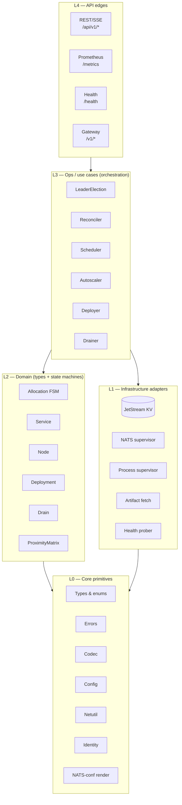
```mermaid
flowchart TB
    subgraph L4["L4 — API edges"]
        direction LR
        REST["REST/SSE<br/>/api/v1/*"]
        PROM["Prometheus<br/>/metrics"]
        HC["Health<br/>/health"]
        GW["Gateway<br/>/v1/*"]
    end

    subgraph L3["L3 — Ops / use cases (orchestration)"]
        direction LR
        LE[LeaderElection]
        REC[Reconciler]
        SCH[Scheduler]
        AS[Autoscaler]
        DEP[Deployer]
        DRN[Drainer]
    end

    subgraph L2["L2 — Domain (types + state machines)"]
        direction LR
        ALLOC["Allocation FSM"]
        SVC[Service]
        NODE[Node]
        DPL[Deployment]
        DRO[Drain]
        PROX[ProximityMatrix]
    end

    subgraph L1["L1 — Infrastructure adapters"]
        direction LR
        KV[(JetStream KV)]
        NSUP[NATS supervisor]
        PSUP[Process supervisor]
        ART[Artifact fetch]
        HP[Health prober]
    end

    subgraph L0["L0 — Core primitives"]
        direction LR
        TYP[Types & enums]
        ERR[Errors]
        CDC[Codec]
        CFG[Config]
        NET[Netutil]
        IDN[Identity]
        NCONF[NATS-conf render]
    end

    L4 --> L3
    L3 --> L2
    L3 --> L1
    L2 --> L0
    L1 --> L0
```

### 3.2 Правила зависимостей

- **L0** не импортирует никакие `internal/*` пакеты. Зависит только от
  stdlib + минимума внешних библиотек (nats.go, yaml, zerolog,
  prometheus client).
- **L1 → L0.** Infra-адаптеры используют core-типы, но не знают про
  domain или ops.
- **L2 → L0.** Domain — это типы + чистые функции. **Domain никогда
  не вызывает infra.** Если allocation хочет «сохранить себя» — это
  делает ops через infra. Domain отдаёт интент.
- **L3 → L0/L1/L2.** Ops — оркестрация. Получает infra через
  интерфейсы (DrainDeps, StateAccessor), не импортирует server/agent.
  Свободно использует domain.
- **L4 → всё.** API — самый верхний слой; превращает HTTP-запросы в
  вызовы L3, ответы из L3 — в JSON/SSE/Prom.
- **composition roots** (`internal/server`, `internal/agent`) — сборка
  L1/L2/L3/L4 в работающий процесс. Сами они не содержат бизнес-логики,
  только wiring.

Проверка инварианта: `go list -deps` или линтер с `depguard`. Любой
цикл или восходящая зависимость (L1→L3) — фатальная ошибка сборки.

### 3.3 Топология узла

Каждый узел — две инстанции `asty` + дочерний `nats-server`:

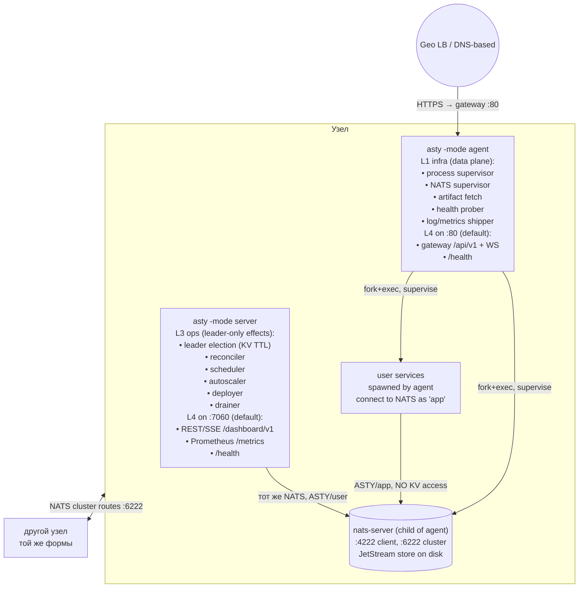
```mermaid
flowchart TB
    GLB(("Geo LB / DNS-based"))

    subgraph Node["Узел"]
        direction TB
        SRV["asty -mode server<br/>L3 ops (leader-only effects):<br/>• leader election (KV TTL)<br/>• reconciler<br/>• scheduler<br/>• autoscaler<br/>• deployer<br/>• drainer<br/>L4 on :7060 (default):<br/>• REST/SSE /dashboard/v1<br/>• Prometheus /metrics<br/>• /health"]
        AGT["asty -mode agent<br/>L1 infra (data plane):<br/>• process supervisor<br/>• NATS supervisor<br/>• artifact fetch<br/>• health prober<br/>• log/metrics shipper<br/>L4 on :80 (default):<br/>• gateway /api/v1 + WS<br/>• /health"]
        NATS[("nats-server (child of agent)<br/>:4222 client, :6222 cluster<br/>JetStream store on disk")]
        SVCS["user services<br/>spawned by agent<br/>connect to NATS as 'app'"]

        AGT -->|fork+exec, supervise| NATS
        AGT -->|fork+exec, supervise| SVCS
        SRV -->|тот же NATS, ASTY/user| NATS
        SVCS -->|ASTY/app, NO KV access| NATS
    end

    GLB -->|HTTPS → gateway :80| AGT

    Node <-->|"NATS cluster routes :6222"| OtherNode["другой узел<br/>той же формы"]
```

**Ключевое:**
- Server и agent — независимые процессы. Падение одного не убивает другой.
- NATS-server — child agent'а, потому что у агента жёсткая зависимость
  от локального NATS (без него data plane не работает). Server тоже
  подключается к нему как клиент.
- Server-процесс на не-лидере **продолжает** обслуживать `/metrics`,
  `/dashboard/v1` (GET, SSE), `/health`. На POST follower'ы шлют
  307 на лидера через `leaderOnly` middleware. Эффекты — нет.

---

## 4. Доменные модели и FSM

### 4.1 Allocation

`Allocation` — конкретная копия сервиса на конкретном узле. Идентификатор:
`(serviceName, nodeID)` (на один сервис — одна копия на узел; для
большего числа копий на узле было бы `allocID`, но Asty этого не
делает).

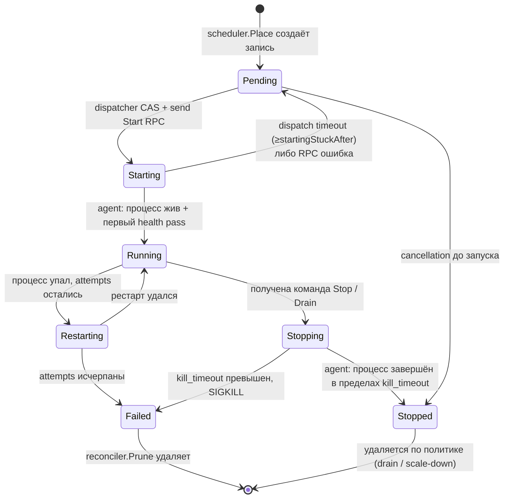
```mermaid
stateDiagram-v2
    [*] --> Pending: scheduler.Place создаёт запись
    Pending --> Starting: dispatcher CAS + send Start RPC
    Starting --> Pending: dispatch timeout (≥startingStuckAfter)<br/>либо RPC ошибка
    Starting --> Running: agent: процесс жив + первый health pass
    Running --> Restarting: процесс упал, attempts остались
    Restarting --> Running: рестарт удался
    Restarting --> Failed: attempts исчерпаны
    Running --> Stopping: получена команда Stop / Drain
    Stopping --> Stopped: agent: процесс завершён в пределах kill_timeout
    Stopping --> Failed: kill_timeout превышен, SIGKILL
    Failed --> [*]: reconciler.Prune удаляет
    Stopped --> [*]: удаляется по политике (drain / scale-down)
    Pending --> Stopped: cancellation до запуска
```

**Инварианты:**
- `Pending`, `Starting`, `Running` — *live* (занимают слот узла, считаются
  в copies).
- `Restarting` — внутренняя фаза `Running`-цикла, тот же слот.
- `Stopping`, `Stopped`, `Failed` — *не-live*, не блокируют размещение
  следующей копии на том же узле.
- Переход в `Running` требует **двух** условий: процесс жив **и** первый
  health-probe прошёл. Это сужает текущее «agent reports alive».
- `Restarting` — отдельное состояние; сейчас в реальной системе
  фактического `Restarting` нет, перезапуск маскируется в `Running`.
  Чёткое состояние нужно, чтобы метрики не врали.

### 4.2 Node

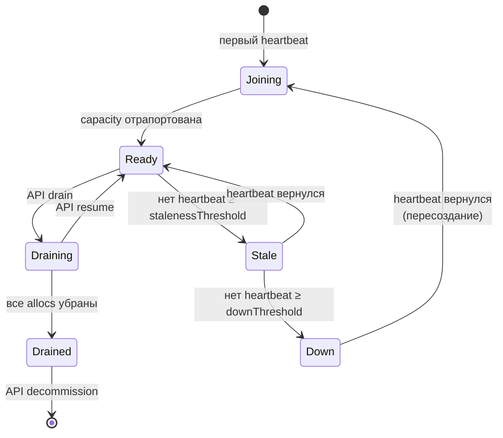
```mermaid
stateDiagram-v2
    [*] --> Joining: первый heartbeat
    Joining --> Ready: capacity отрапортована
    Ready --> Draining: API drain
    Draining --> Drained: все allocs убраны
    Draining --> Ready: API resume
    Ready --> Stale: нет heartbeat ≥ stalenessThreshold
    Stale --> Ready: heartbeat вернулся
    Stale --> Down: нет heartbeat ≥ downThreshold
    Drained --> [*]: API decommission
    Down --> Joining: heartbeat вернулся<br/>(пересоздание)
```

**Добавлены явные `Joining` и `Stale`** относительно текущей системы:
- `Joining` различает «узел в KV, но ещё не готов принимать копии» от
  «Ready». Сейчас разница смазана.
- `Stale` — узел задерживается с heartbeat, но ещё не считается мёртвым.
  Это окно, в которое scheduler не размещает новое, но не убивает
  существующее.

### 4.3 Service

`ServiceDefinition` — декларативный манифест из `.asty`. Имеет два
типа:

- **`system`** — запускается ровно по одной копии на каждый Ready-узел.
  Не масштабируется. Использует cluster-wide размещение (нет «свободных
  узлов»).
- **`service`** — масштабируется автоскейлером в пределах `MinCopies` ↔
  `MaxCopies`. Размещение учитывает локальность и DC-диверсити.

### 4.4 Deployment

Это самое слабое место текущей системы. Здесь FSM выписан полностью,
включая **реальный** rollback:

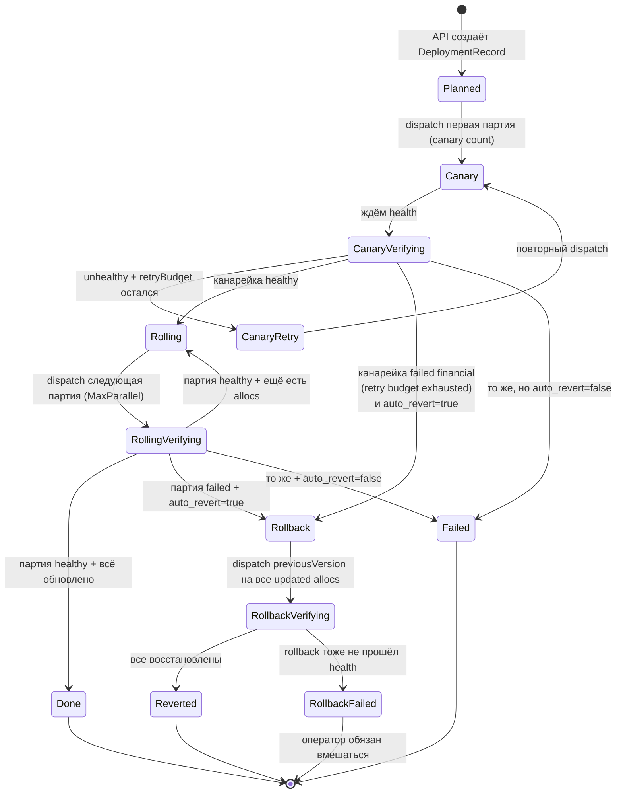
```mermaid
stateDiagram-v2
    [*] --> Planned: API создаёт DeploymentRecord
    Planned --> Canary: dispatch первая партия (canary count)
    Canary --> CanaryVerifying: ждём health
    CanaryVerifying --> CanaryRetry: unhealthy + retryBudget остался
    CanaryRetry --> Canary: повторный dispatch
    CanaryVerifying --> Rolling: канарейка healthy
    CanaryVerifying --> Rollback: канарейка failed financial<br/>(retry budget exhausted)<br/>и auto_revert=true
    CanaryVerifying --> Failed: то же, но auto_revert=false

    Rolling --> RollingVerifying: dispatch следующая партия (MaxParallel)
    RollingVerifying --> Rolling: партия healthy + ещё есть allocs
    RollingVerifying --> Done: партия healthy + всё обновлено
    RollingVerifying --> Rollback: партия failed + auto_revert=true
    RollingVerifying --> Failed: то же + auto_revert=false

    Rollback --> RollbackVerifying: dispatch previousVersion на все updated allocs
    RollbackVerifying --> Reverted: все восстановлены
    RollbackVerifying --> RollbackFailed: rollback тоже не прошёл health
    RollbackFailed --> [*]: оператор обязан вмешаться

    Done --> [*]
    Failed --> [*]
    Reverted --> [*]
```

**Что нового по сравнению с текущим:**
- Явное состояние `Rollback` с **реальной** реакцией: перевыкатить
  `previousVersion` (`DeploymentPlan.CurrentVersion`) на все аллокации,
  которые уже успели обновиться, и дождаться health.
- `CanaryRetry` — конечный бюджет повторных попыток канарейки
  (например, 1 ретрай по умолчанию) перед признанием fatal.
- `RollbackFailed` — терминальное состояние, требующее оператора.
  Метрика `asty_deploy_state{state="rollback_failed"}` должна
  алертить.
- `MaxParallel` — обязательное поле с минимумом 1; деплой с
  `MaxParallel<=0` — отклоняется `Validate` ещё на стадии Planned.
- `Canary` — поле в `.asty` (`update.canary`), а не хардкод в server.
  По умолчанию `1`, минимум `0` (deploy без канарейки), максимум —
  `min(len(allocs), MaxParallel)`.

### 4.5 Drain

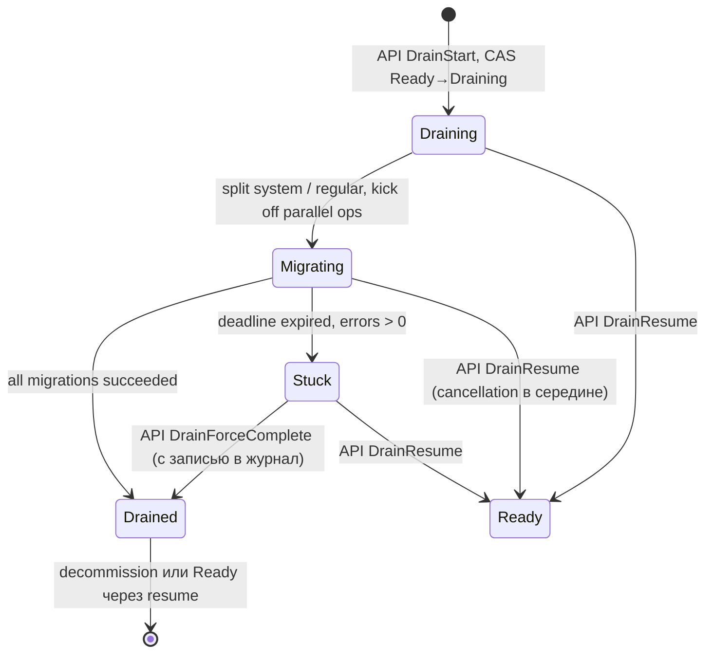
```mermaid
stateDiagram-v2
    [*] --> Draining: API DrainStart, CAS Ready→Draining
    Draining --> Migrating: split system / regular, kick off parallel ops
    Migrating --> Drained: all migrations succeeded
    Migrating --> Stuck: deadline expired, errors > 0
    Draining --> Ready: API DrainResume
    Migrating --> Ready: API DrainResume (cancellation в середине)
    Stuck --> Drained: API DrainForceComplete (с записью в журнал)
    Stuck --> Ready: API DrainResume
    Drained --> [*]: decommission или Ready через resume
```

**Что нового:**
- Все аллокации мигрируют **параллельно** — system и regular.
  Параллелизм ограничен глобальным `maxConcurrentMigrations` (default
  4) на drain, чтобы не зальёт NATS RPC.
- Появляется явное `Stuck`-состояние: deadline истёк, но какие-то
  миграции ещё не завершены. Оператор решает: force-complete (потеря
  тех аллокаций) или resume (откат).

### 4.6 Kill (abrupt decommission)

`POST /dashboard/v1/nodes/{id}/kill` — дашбордный аналог
`deploy/dev/start.sh remove`. Для случаев, когда узел не отвечает или
оператор сознательно отказывается от graceful-миграции. Терминальная
операция; обратной кнопки нет — после `Drained`/удаления узел
вернётся только новым `Joining`.

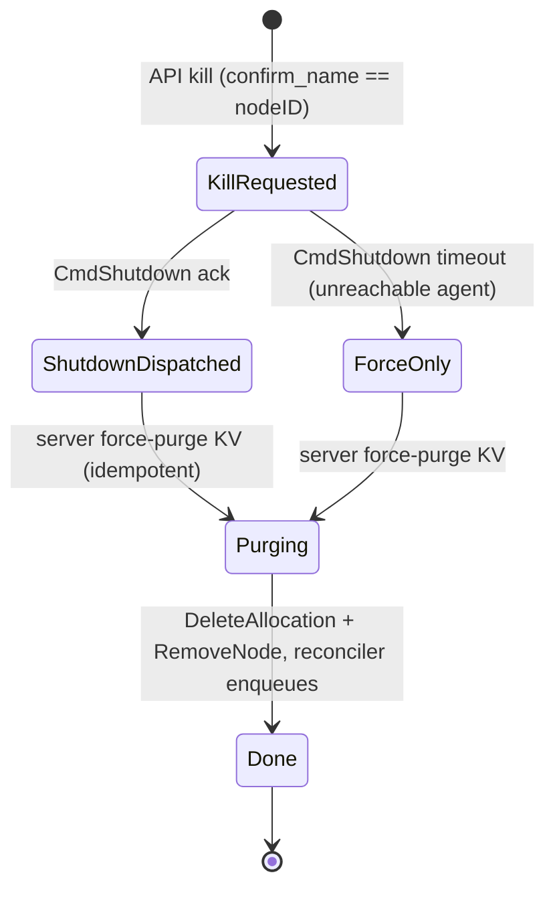
```mermaid
stateDiagram-v2
    [*] --> KillRequested: API kill (confirm_name == nodeID)
    KillRequested --> ShutdownDispatched: CmdShutdown ack
    KillRequested --> ForceOnly: CmdShutdown timeout (unreachable agent)
    ShutdownDispatched --> Purging: server force-purge KV (idempotent)
    ForceOnly --> Purging: server force-purge KV
    Purging --> Done: DeleteAllocation + RemoveNode, reconciler enqueues
    Done --> [*]
```

- **Обязательное name-confirmation**: тело должно содержать
  `confirm_name == nodeID`, иначе 400. UI блокирует кнопку до точного
  совпадения.
- **`CmdShutdown`** — новый kind (`asty.v1.agent.<nodeID>.cmd.shutdown`).
  Хэндлер агента: ack первым, cancel ctx async. Дальше работает
  существующий SIGTERM-путь (`agent/start.go` + `agent/natsleave.go`):
  decommission NATS, shrink streams при шринке до 1, deregister
  `node.<id>` из KV, `stopAllProcesses`.
- **Force-purge** на стороне сервера — `DeleteAllocation` для каждой
  живой аллокации + `RemoveNode`. Идемпотентно: при достижимом агенте
  он сам всё снёс, у нас будет два warning'а «not found» и тишина.
- **Reconciler** ловит `NodeDeleted` через `watchNodesToQueue` и
  перепланирует затронутые сервисы на оставшиеся `NodeReady`-узлы.
- UX: спиннер «Killing node {name}…» во время запроса, финальный тост
  «Node killed», редирект на `/nodes`. Время отклика — 2–10 с (ack от
  агента + force-purge + NATS round-trips).

---

## 5. Циклы управления (L3 ops)

### 5.1 Reconciler

Единственный пишущий цикл на лидере. Все остальные L3-компоненты
вызываются из reconcile-пайплайна.

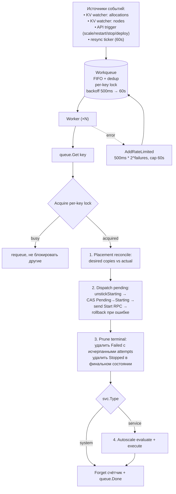
```mermaid
flowchart TB
    Events["Источники событий:<br/>• KV watcher: allocations<br/>• KV watcher: nodes<br/>• API trigger (scale/restart/stop/deploy)<br/>• resync ticker (60s)"]
    Events --> Q[("Workqueue<br/>FIFO + dedup<br/>per-key lock<br/>backoff 500ms → 60s")]
    Q --> Worker["Worker (×N)"]
    Worker --> Get[queue.Get key]
    Get --> Lock{Acquire per-key lock}
    Lock -->|busy| Skip[requeue, не блокировать другие]
    Lock -->|acquired| P1[1. Placement reconcile:<br/>desired copies vs actual]
    P1 --> P2["2. Dispatch pending:<br/>unstickStarting →<br/>CAS Pending→Starting →<br/>send Start RPC →<br/>rollback при ошибке"]
    P2 --> P3["3. Prune terminal:<br/>удалить Failed с исчерпанными attempts<br/>удалить Stopped в финальном состоянии"]
    P3 --> P4{svc.Type}
    P4 -->|service| AS["4. Autoscale evaluate + execute"]
    P4 -->|system| Done
    AS --> Done[Forget счётчик + queue.Done]
    Worker -. error .-> RL["AddRateLimited<br/>500ms * 2^failures, cap 60s"]
    RL --> Q
```

**Per-key lock** — новинка относительно текущего: гарантирует, что
если ключ повторно попал в очередь во время обработки, второй worker
не возьмёт его до завершения первого. Сейчас это реализовано
дедупликацией в самом workqueue, но при per-key lock семантика
очевиднее и поддаётся тестированию изолированно.

### 5.2 Autoscaler

Чистая функция от состояния → решение. Никаких побочных эффектов.
Решение исполняется через `ExecuteScalingDecision`, которое пишет KV.

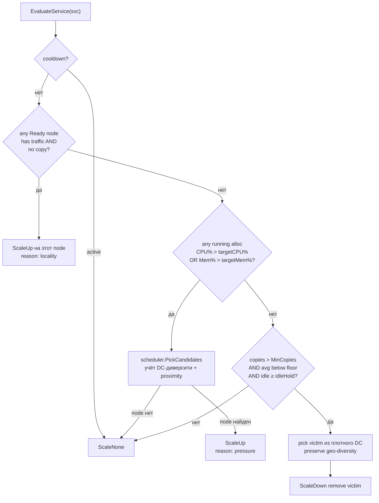
```mermaid
flowchart TB
    Eval["EvaluateService(svc)"]
    Eval --> CD{cooldown?}
    CD -->|active| Noop[ScaleNone]
    CD -->|нет| Up1{any Ready node<br/>has traffic AND<br/>no copy?}
    Up1 -->|да| Pick1[ScaleUp на этот node<br/>reason: locality]
    Up1 -->|нет| Up2{any running alloc<br/>CPU% > targetCPU%<br/>OR Mem% > targetMem%?}
    Up2 -->|да| PickF[scheduler.PickCandidates<br/>учёт DC-диверсити + proximity]
    PickF -->|node найден| Pick2[ScaleUp<br/>reason: pressure]
    PickF -->|node нет| Noop
    Up2 -->|нет| Down{copies > MinCopies<br/>AND avg below floor<br/>AND idle ≥ idleHold?}
    Down -->|да| Victim[pick victim из плотного DC<br/>preserve geo-diversity]
    Victim --> Pick3[ScaleDown remove victim]
    Down -->|нет| Noop
```

**Существенные правки относительно текущего:**

1. **Memory сравнивается в `%`, а не в MB.** `MemoryUsage` хранится в
   MB; `TargetMemory` интерпретируется как процент от `node.MemoryTotal`,
   распределённый на копию. Сравнение: `MemoryUsage * 100 / capacityPerCopy
   > TargetMemory`. Текущая реализация сравнивает MB с числом 75 —
   баг.
2. **`idleHold`** — новый параметр (default 5 минут). Scale-down не
   срабатывает мгновенно после падения avg ниже floor; должно держаться
   `idleHold` подряд. Снижает флаппинг.
3. **`MaxCopies`** — добавлен (новое поле). Сейчас верхняя граница —
   только число Ready-узлов. Это удобно, но дорого: ничто не мешает
   автоскейлеру случайно заполнить весь кластер одним сервисом, если
   правила его триггерят.

### 5.3 Deployer

См. диаграмму в §4.4. Дополнительные правила:

- `DeploymentPlan.MaxParallel` — обязателен, минимум 1. `Validate()`
  на стадии Planned отвергает 0 или отрицательное.
- `DeploymentPlan.Canary` — опционален, default 1, должен быть ≤
  `MaxParallel` и ≤ `len(allocs)`.
- **Rollback — настоящий**: dispatcher шлёт Start RPC с
  `previousVersion`, ждёт health, отмечает каждый rollback-step в
  `DeploymentRecord.RollbackSteps[]` для аудита.
- `RollbackFailed` ставит метку `state=rollback_failed` на сервис в
  KV; reconciler видит это и **прекращает** autoscale до снятия метки
  оператором. Иначе автоскейлер начнёт «исправлять» вручную, что
  опаснее, чем оставить как есть.

### 5.4 Drainer

См. §4.5. Дополнительно:

- Параллелизм миграций — `maxConcurrentMigrations` (default 4).
  Регулирует нагрузку на NATS RPC: при большом числе аллокаций на
  узле всё сразу не вырывается.
- Перед записью `NodeDrained` — финальная проверка `ListAllocations(node)`
  возвращает 0. Если нет — `Stuck`, не `Drained`.

### 5.5 Scheduler

Чистая функция размещения:

```
PickCandidates(
    svc *ServiceDefinition,
    healthyNodes []Node,
    occupied map[NodeID]bool,           // где уже есть копия svc
    dcCounts map[DC]int,                // сколько копий по DC
    nodeAllocCounts map[NodeID]int,     // загрузка узла другими сервисами
    n int,                              // сколько кандидатов нужно
) []Node
```

Алгоритм:
1. Отфильтровать узлы где уже есть копия.
2. Отфильтровать узлы без достаточной capacity (CPU/Mem) под
   `svc.Resources`.
3. Сгруппировать по DC; сортировать DC по `min(dcCounts)` (предпочесть
   DC с наименьшим числом копий — диверсити).
4. Внутри DC — proximity matrix: предпочесть DC, чьи остальные узлы
   с трафиком ближе.
5. Внутри DC по узлам — сортировать по `nodeAllocCounts` ASC.
6. Взять первые `n`.

Никакой случайности. Один и тот же state → один и тот же результат.

### 5.6 Leader election

KV-бакет `asty-leader` с записью `leader` и TTL (default 5 с).
Кандидат пытается `Create` с TTL; владелец каждые `ttl/2` секунд
обновляет запись. Watcher на эту запись на всех серверах оповещает о
смене лидера; effect-старт/стоп — через `startLeaderWork`/`stopLeaderWork`.

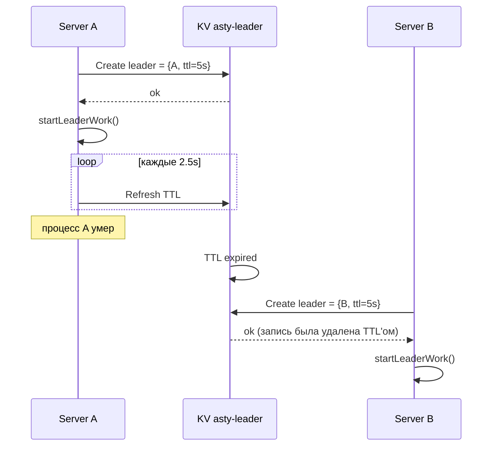
```mermaid
sequenceDiagram
    participant SrvA as Server A
    participant KV as KV asty-leader
    participant SrvB as Server B
    SrvA->>KV: Create leader = {A, ttl=5s}
    KV-->>SrvA: ok
    SrvA->>SrvA: startLeaderWork()
    loop каждые 2.5s
        SrvA->>KV: Refresh TTL
    end
    Note over SrvA: процесс A умер
    KV->>KV: TTL expired
    SrvB->>KV: Create leader = {B, ttl=5s}
    KV-->>SrvB: ok (запись была удалена TTL'ом)
    SrvB->>SrvB: startLeaderWork()
```

**Гарантии:**
- `startLeaderWork` идемпотентен. Двойной вызов — no-op.
- `stopLeaderWork` дожидается завершения active-горутин с deadline
  `2 × TTL`.
- В split-brain (между двумя серверами KV видит лидера по-разному)
  оба останавливают свою работу; никто не пишет до восстановления.
  Это требование к адаптеру KV: использовать `OptimisticWrite` на
  всех KV-записях ops-слоя, реагировать на конфликт.

---

## 6. Контракты данных и сообщений

### 6.1 KV-схема

Бакет `asty-cluster` (реплики = `min(cluster_size, 3)`):

| Ключ | Значение | Кодек | Писатель |
|---|---|---|---|
| `nodes/<nodeID>` | `NodeInfo` | `codec.State` (CBOR) | agent (heartbeat) |
| `allocs/<service>/<nodeID>` | `ServiceAllocation` | `codec.State` | reconciler, agent (статус) |
| `services/<name>` | `ServiceDefinitionCache` | `codec.State` | server (loader) |
| `cooldowns/<service>` | `ServiceCooldown` | `codec.State` | autoscaler |
| `scale/<service>` | `ScaleOverride` | `codec.State` | API (manual scale) |
| `deployments/<service>` | `DeploymentRecord` | `codec.State` | deployer |
| `drains/<nodeID>` | `DrainOp` | `codec.State` | drainer |

Бакет `asty-leader` (replicas=3, TTL включен):

| Ключ | Значение | TTL |
|---|---|---|
| `leader` | `LeaderInfo` | 5 с |

Пользовательские бакеты (объявляются в `.asty` `kv:`) живут отдельно.

### 6.2 NATS subjects

Конвенция: `asty.v1.<role>.<nodeID>.<topic>` для всего per-node
трафика; topics без `<nodeID>` зарезервированы для broadcast.
NATS-wildcard `>` упрощает фильтрацию по роли (например,
`asty.v1.agent.>` собирает всё, что публикуют агенты).

```
asty.v1.agent.<nodeID>.cmd.<verb>     # leader → agent RPC (req-reply)
                                      # verb: start, stop, restart, getlogs, shutdown
asty.v1.agent.<nodeID>.ping           # proximity probe (agent answers)
asty.v1.agent.<nodeID>.ping-peer      # cross-node ping (initiator side)
asty.v1.agent.<nodeID>.logs.agent     # agent's own zerolog stream
asty.v1.agent.<nodeID>.logs.<service> # spawned service stdout/stderr
asty.v1.server.logs                   # server's own zerolog stream (broadcast)
asty.v1.metrics.gateway.<nodeID>      # agent gateway → server (RPS report)
asty.v1.drain.progress                # drainer → fanout
                                      # (DrainStatus embeds node_id in payload,
                                      # so no nodeID suffix on subject)
asty.v1.deploy.progress.<service>     # deployer → fanout (per-service)
asty.v1.audit.<resource>.<action>     # write-API audit (see §10.5)
$SYS.REQ.SERVER.<id>.STATSZ           # SYS-account observer
$SYS.REQ.SERVER.<id>.JSZ              # SYS-account observer
```

**Правила:**
- `asty.v1.*` — major version в субъекте. Любая ломающая смена
  payload — `asty.v2.*` параллельно, миграция без даунтайма.
- Все payload — `codec.Wire` (CBOR), кроме `drain.progress` и
  `deploy.progress`, которые умышленно JSON (потребляются SSE-клиентами
  без декодирования на стороне сервера).
- `cmd.*` — request-reply с deadline 30 с. Reply содержит typed result
  или `ErrorReply{code,msg}`.
- События lifecycle'а (alloc.status, process.exit) **не** идут
  отдельным subject'ом — состояние пишется в KV (`asty-cluster`),
  watcher'ы подписаны на KV-update'ы. NATS-fanout-evt'ов отдельно
  не существует.

### 6.3 Конфиг nats.conf

Рендерится из `core/config.NATSConfig` + identity + peer list. Структурно:

```
server_name: "<nodeID>"
listen: <nodeIP>:<port>

jetstream {
  store_dir: "<path>"
  max_mem:  "<size>"
  max_file: "<size>"
}

cluster {            # пишется только если len(peers) > 0
  name: "<name>"
  listen: <nodeIP>:<cluster_port>
  routes: [
    "nats-route://<peer1>:<cluster_port>"
    "nats-route://<peer2>:<cluster_port>"
  ]
}

accounts {
  ASTY  { jetstream: enabled, users: [ ... ] }
  SYS   { users: [ ... ] }
}
system_account: SYS
```

`cluster{}`-блок — критический switch: его наличие/отсутствие
определяет, нужен hot-reload (`SIGHUP`) или cold restart. См. §11.2.

---

## 7. HTTP-поверхность

### 7.1 Три поверхности, два листенера

| Поверхность | Default host:port | Default prefix | ENV |
|---|---|---|---|
| Dashboard (admin REST + SSE) | `127.0.0.1:7060` | `/dashboard/v1` | `A_DASHBOARD_{HOST,PORT,PREFIX}` |
| Prometheus exposition | `127.0.0.1:7060` (shared) | `/metrics` (exact match) | `A_PROMETHEUS_{HOST,PORT,PREFIX}` |
| Gateway (user traffic) | `0.0.0.0:80` | `/api/v1` | `A_GATEWAY_{HOST,PORT,PREFIX}` |

Когда `A_DASHBOARD_PORT == A_PROMETHEUS_PORT` (по умолчанию так и
есть) — один `http.Server` обслуживает обе поверхности. Когда
порты разные — поднимается второй listener
(`server.runStandalonePrometheus`).

`/health` живёт на корне dashboard-листенера (без префикса) для
kube-probe / curl-проверок инфраструктуры.

NATS HTTP-listener отключён намеренно: stats тянутся через
`$SYS.REQ.SERVER.<id>.STATSZ/JSZ` поверх существующего NATS-соединения.
Никакого `:8222`. Это снимает целый класс атак на сеть NATS.

### 7.2 Dashboard listener layout (`:7060` по умолчанию)

```mermaid
flowchart LR
    Req[":7060"]
    Req --> Mux[outer mux]
    Mux -->|GET /health| H["liveness:<br/>200 если nats reachable<br/>и leader известен"]
    Mux -->|GET /metrics (exact)| P["Prometheus exposition<br/>(private Registry,<br/>работает на всех серверах)"]
    Mux -->|/dashboard/v1/*| A[data plane API]

    A --> Cluster[/dashboard/v1/]
    A --> Nodes[/dashboard/v1/nodes/...]
    A --> Services[/dashboard/v1/services/...]
    A --> Allocations[/dashboard/v1/nodes/.../allocations/...]
    A --> Logs[/dashboard/v1/logs<br/>/dashboard/v1/nodes/{id}/logs<br/>...]
```

**Правила:**

- `GET /dashboard/v1/...` — content-negotiation по `Accept`:
  `application/json` → JSON snapshot, `text/event-stream` → SSE.
- `POST /dashboard/v1/...` — write-операции. Проходят через цепочку
  middleware `tokenAuth → leaderOnly → auditLog → handler`:
  - `tokenAuth` — constant-time-сравнение токена из
    `Authorization: Bearer` или `X-Asty-Token` с `cfg.Token`.
  - `leaderOnly` — server-side reverse-proxy на лидера через
    `httputil.NewSingleHostReverseProxy`. Follower форвардит запрос
    на `http://<leader-IP>:<dashboard.port>`, стримит ответ обратно,
    добавляет заголовок `X-Asty-Leader`. Без 307-redirect, чтобы
    избежать CORS/preflight-проблем для не-collocated SPA.
  - `auditLog` — публикует `types.AuditEvent` (CBOR через
    `codec.Wire`) на `asty.v1.audit.<resource>.<action>` после
    того, как handler вернётся, с захваченным HTTP-статусом.
- `GET /metrics` (точный путь, не префикс) — Prometheus.
  Отдаётся на каждом сервере; метрика `asty_leader` пишется
  одинаково (читается из снапшота), `node_id`-label — это id
  текущего лидера.

### 7.3 Gateway listener layout (`:80` по умолчанию)

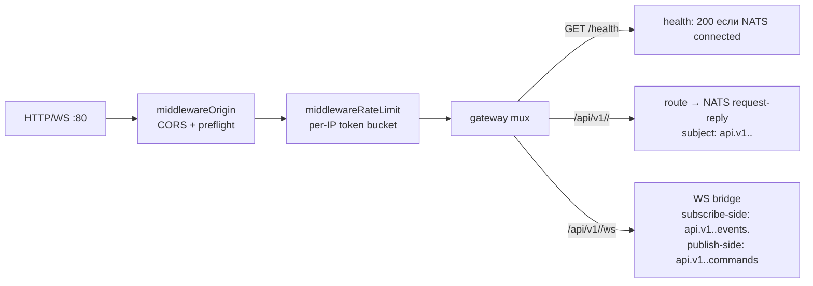
```mermaid
flowchart LR
    Ext["HTTP/WS :80"]
    Ext --> O[middlewareOrigin<br/>CORS + preflight]
    O --> RL[middlewareRateLimit<br/>per-IP token bucket]
    RL --> Mux[gateway mux]
    Mux -->|GET /health| GH["health: 200 если NATS connected"]
    Mux -->|/api/v1/<svc>/<method...>| Route["route → NATS request-reply<br/>subject: api.v1.<svc>.<method>"]
    Mux -->|/api/v1/<svc>/ws| WS["WS bridge<br/>subscribe-side: api.v1.<svc>.events.<sessionID><br/>publish-side: api.v1.<svc>.commands"]
```

- Префикс `/api/v1` стрипается mux'ом перед попаданием в `route()` —
  поэтому путь-валидация `^[A-Za-z0-9_-]+$` применяется только к
  сегментам после префикса (это и есть имя сервиса + метод).
- Сабжект NATS строится исключительно из этих провалидированных
  сегментов. Никаких пользовательских строк в сабжект без валидации.
- WS pings — 30 с, read deadline 60 с, read limit 64 КБ. Цифры в коде,
  не в конфиге, потому что инвариант протокола.

---

## 8. Конфигурация

### 8.1 Источники

```
defaults (compiled)
  ↓
YAML (./config.asty или -config)
  ↓
env override (A_*)
  ↓
Validate()
```

**Никаких других точек входа конфига.** Если фича требует значения —
это поле в `Config`, и оно проходит весь конвейер. `os.Getenv` в любом
пакете кроме `core/config` запрещён.

### 8.2 Структура (топ-level)

```yaml
domain: example.com           # required (prod)
datacenter: dc1
node_id: <generated_if_empty>
node_ip: <auto_if_empty>
token: <secret>               # required (prod)
log_level: info
dev_mode: false

nats:
  user, password
  observer_user, observer_password   # may be empty (disables SYS-account metrics)
  app_user, app_password             # must differ from `user`
  server:
    port: 4222
    jetstream: { store_dir, max_mem, max_file }
    cluster: { name, port }
    accounts: { ASTY: {...}, SYS: {...} }
    system_account: SYS

autoscale:
  min_copies: 3
  max_copies: 0                 # 0 = unlimited (cluster-size cap)
  target_cpu: 75                # %
  target_memory: 75             # % (NOT MB; см. §5.2)
  traffic_rps_threshold: 5      # /s avg over traffic_window
  traffic_window: 60s
  cooldown_up: 30s
  cooldown_down: 5m
  idle_hold: 5m
  eval_interval: 10s
  dc_latency: <path or inline>
  controller_workers: 2

resources:
  reserved_cpu: 100             # MHz
  reserved_memory: 250          # MB

dashboard:
  host: 127.0.0.1               # default
  port: 7060                    # default — shared with prometheus when ports match
  prefix: /dashboard/v1         # default

prometheus:
  host: 127.0.0.1
  port: 7060                    # default = same as dashboard → shared listener
  prefix: /metrics              # exact-match path

agent:
  work_dir: /var/lib/asty
  service_dir: /etc/asty/services
  capacity: { cpu_total, memory_total, disk_total, swap_total,
              disk_os_baseline, nats_disk_baseline, disk_type }

artifact:
  arch: amd64                   # fallback runtime.GOARCH if empty
  github_repo: ""               # for ${GITHUB_REPO} substitution

gateway:
  enabled: true
  host: 0.0.0.0                 # user-facing surface, binds publicly
  port: 80
  prefix: /api/v1
  http: { read_*, write_*, idle_*, nats_*, ws_* }
  allowed_hosts: ["..."]
  rate_limit: { rate, burst, max_ws_conns, trusted_proxy, max_ips }
```

### 8.3 Env override convention

| Prefix | Назначение |
|---|---|
| `A_*` (без подпрефикса) | top-level + autoscale + resources |
| `A_NATS_*` | nats.* поля + peers (PeersFile, Peers) |
| `A_DASHBOARD_*` | dashboard.{host,port,prefix} |
| `A_PROMETHEUS_*` | prometheus.{host,port,prefix} |
| `A_GATEWAY_*` | gateway.* (включая host/port/prefix, HTTP timeouts, rate limit, ALLOWED_HOSTS) |
| `A_AGENT_*` (косвенно) | agent.work_dir, service_dir |
| `A_ARTIFACT_*` (косвенно: `A_ARCH`, `A_GITHUB_REPO`) | artifact template substitution |

**Подстановка в YAML.** При `Load()` строки `${VAR}` в YAML
расширяются из env (`os.Expand` с whitelist `A_*` и пользовательскими
секретами). Bareword `$NAME` без скобок не трогается (NATS-сабжекты
`$SYS.REQ.*` переживают).

### 8.4 Validate

Что обязано отвергнуть `Validate()`:

- `domain == ""` вне `dev_mode`.
- `token == ""` вне `dev_mode`.
- `nats.user == nats.app_user` (см. принцип 7).
- `nats.server.port == nats.server.cluster.port`.
- `nats.server.port` вне `[1, 65535]`.
- `gateway.enabled && (rate_limit.rate <= 0 OR burst <= 0 OR
  max_ws_conns <= 0 OR max_ips <= 0)`.
- `autoscale.min_copies < 1`.
- `autoscale.max_copies > 0 AND max_copies < min_copies`.
- `autoscale.target_cpu / target_memory` вне `(0, 100)`.
- `autoscale.idle_hold < 0`.

---

## 9. Наблюдаемость

### 9.1 Mirror rule (обязательное)

Каждая метрика, которую показывает UI, обязана быть экспонирована в
`/metrics`. Каждая метрика в `/metrics` имеет смысл для оператора —
не «потому что было удобно посчитать». Дашборд и Prometheus читают
один источник правды (`StreamHub.Snapshot()`).

### 9.2 Что в `/metrics` и что нет

| Уровень | Префикс | Лейблы |
|---|---|---|
| Кластер | `asty_cluster_*` | — |
| Узел | `asty_node_*` | `node_id`, `datacenter` |
| Сервис | `asty_service_*` | `service` |
| Аллокация | `asty_alloc_*` | `service`, `node_id` |
| Деплой | `asty_deploy_*` | `service`, `state` |
| Лидер | `asty_leader` | `node_id` |
| NATS на узле | `asty_node_nats_*` | `node_id`, `datacenter` |
| NATS на кластере | `asty_cluster_nats_*` | — |

**Чего НЕ должно быть в `/metrics`:**
- Метрик пользовательских сервисов (`gateway_<service>_*`, `xauth_*`).
  Gateway не экспонирует свой `/metrics` вообще.
- Логов и log-event counters. Логи — отдельный канал.

### 9.3 Логи

Zerolog JSON, поток через NATS subject `asty.v1.log.*`. На дашборд —
SSE (`/api/v1/logs/...`). На внешний шиппер — он подписывается на
сабжект сам. Asty не хранит логи долговременно.

### 9.4 События

Дискретные факты (alloc_failed, scale_up, deploy_started, …) живут в
ring-buffer `EventBuffer` на сервере и стримятся через SSE. **Не
смешиваются с логами**: события — это типизованные структуры с
`Type`, `Subject`, `Reason`, `Timestamp`; логи — свободный текст.

### 9.5 Трассировка

Не в scope Asty. Пользовательские сервисы могут открыть OTLP-канал
на свой collector, Asty этому не мешает.

---

## 10. Безопасность

### 10.1 Идентичности и учётки

Три набора в NATS:

| Учётка | Аккаунт | Кто использует | Доступ |
|---|---|---|---|
| `user` | ASTY | server + agent | весь `asty.v1.*` + JS KV |
| `app_user` | ASTY | пользовательские сервисы | `api.v1.*` + объявленные `.asty kv:`-бакеты, **БЕЗ** доступа к `asty-cluster` |
| `observer_user` | SYS | agent (ncSys) | только `$SYS.REQ.SERVER.*.STATSZ/JSZ` |

`Validate()` отвергает совпадение `user == app_user`.

### 10.2 Артефакты

- Скачивание только по HTTPS.
- Checksum SHA-256 обязателен в `.asty artifact.checksum`.
- Кэш на диск: `<work_dir>/artifacts/<sha256>/`.
- Permissions: 0700 на dir, 0400 на бинарь до chmod +x.

### 10.3 Процесс изоляция

- **Drop-root агента.** Агент стартует под root (через systemd
  `User=` unset либо явное `User=root`), чтобы:
  - забиндить `:80` для gateway,
  - exec'нуть дочерний `nats-server` с `Credential={uid,gid}`-ом
    выделенного пользователя,
  - chown'ить `work_dir` и `nats.store_dir` под целевого юзера.

  После этого агент сам вызывает `setgid` → `setuid` на uid
  **выделенной системной учётки `asty`** (создаётся при установке:
  `useradd --system asty`). С этого момента и до конца жизни
  процесса агент работает как `asty`. Пользовательские сервисы,
  запускаемые позже через `fork+exec`, наследуют uid `asty`
  автоматически — `Credential` им явно не задаётся.

  **Почему именно `asty`, а не `nobody`:** `nobody` — это шарящаяся
  учётка. Любой другой демон на хосте, тоже работающий под
  `nobody`, может `ptrace`-нуть наш процесс и читать
  `/proc/<pid>/mem`, выдернуть оттуда NATS-кред и взять кластер.
  Выделенная `asty` закрывает same-uid вектор.

  Если `asty` отсутствует на хосте, агент остаётся root'ом и пишет
  громкий warning в журнал — fail-loud, чтобы misconfiguration не
  превратился в тихий security-debt.

  Альтернатива на Linux: `User=asty` + `AmbientCapabilities=
  CAP_NET_BIND_SERVICE` в systemd unit. Тогда агент с самого начала
  под `asty`, drop становится no-op (определяется в
  `resolveDropTarget` по `os.Geteuid() != 0`).

- `user:` в `.asty` сейчас НЕ применяется в `Credential` дочернего
  процесса — все user-services наследуют uid агента (`asty`). Поле
  оставлено в схеме на случай возвращения per-service Credential,
  но в коде на момент TZ — игнорируется.

### 10.4 API

- `/dashboard/v1/*` write-операции — только лидер; CSRF не релевантен
  (control API за внутренней сетью), но `token`-auth обязателен.
- Token проверяется в middleware на каждом write-запросе; constant-time
  сравнение (`crypto/subtle`).
- `/metrics`, `/health` — без auth (scrape, probe).
- Gateway `/api/v1/*` — auth на стороне сервиса, не gateway'я. Сам
  gateway обеспечивает только CORS и rate-limit.

### 10.5 Audit log

Каждая write-операция на dashboard'е публикует `types.AuditEvent` в
NATS subject `asty.v1.audit.<resource>.<action>` (payload — CBOR
через `codec.Wire`). Состав события:

```
{
  timestamp:  unix seconds at handler exit,
  method:     HTTP method,
  path:       prefix-stripped path,
  resource:   "nodes" | "services" | "allocations" | "unknown",
  action:     "drain" | "pause" | "deploy" | "scale" | "restart" | "stop" | ...,
  status:     captured HTTP response code,
  node_id, service, alloc_id:  per-target fields when applicable,
  actor_ip:   r.RemoteAddr (X-Forwarded-For honoured только при
              явно сконфигурированном trusted-proxy),
  request_id: эхо X-Request-Id,
  at:         RFC3339 form of timestamp,
}
```

Asty сам долговременно не хранит audit-историю — внешний шиппер
(Vector / Datadog / Loki / BigQuery) подписан на `asty.v1.audit.>`.
Failure публикации логируется на warn — audit не должен gating'ить
запись (это observation, а не authorization).

---

## 11. Операционные сценарии

### 11.1 Поднятие узла

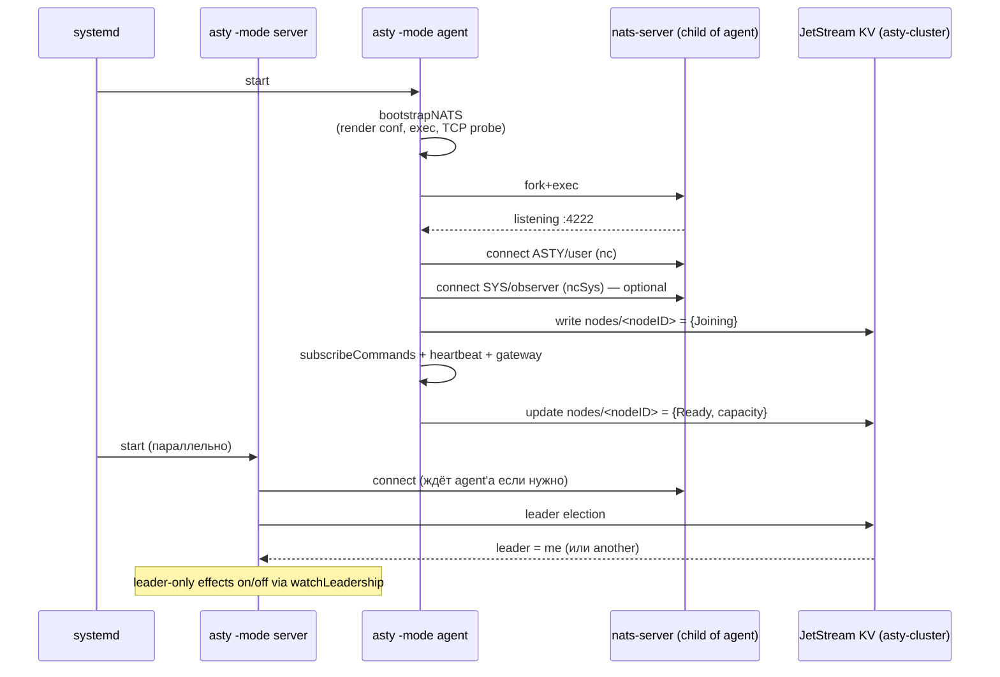
```mermaid
sequenceDiagram
    participant OS as systemd
    participant SrvP as asty -mode server
    participant AgtP as asty -mode agent
    participant NATSd as nats-server (child of agent)
    participant KV as JetStream KV (asty-cluster)
    
    OS->>AgtP: start
    AgtP->>AgtP: bootstrapNATS<br/>(render conf, exec, TCP probe)
    AgtP->>NATSd: fork+exec
    NATSd-->>AgtP: listening :4222
    AgtP->>NATSd: connect ASTY/user (nc)
    AgtP->>NATSd: connect SYS/observer (ncSys) — optional
    AgtP->>KV: write nodes/<nodeID> = {Joining}
    AgtP->>AgtP: subscribeCommands + heartbeat + gateway
    AgtP->>KV: update nodes/<nodeID> = {Ready, capacity}
    
    OS->>SrvP: start (параллельно)
    SrvP->>NATSd: connect (ждёт agent'а если нужно)
    SrvP->>KV: leader election
    KV-->>SrvP: leader = me (или another)
    Note over SrvP: leader-only effects on/off via watchLeadership
```

### 11.2 Расширение кластера на лету

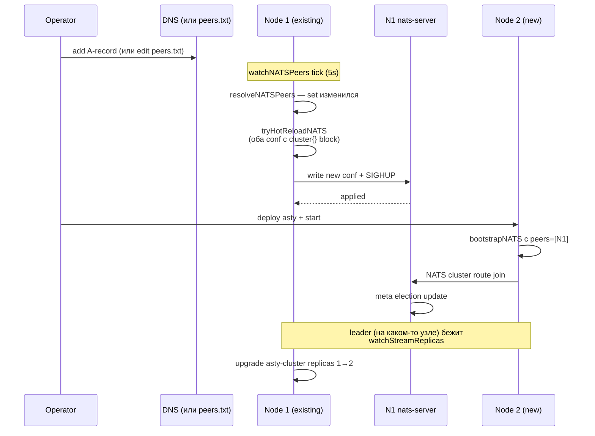
```mermaid
sequenceDiagram
    participant Op as Operator
    participant DNS as DNS (или peers.txt)
    participant N1 as Node 1 (existing)
    participant N1NATS as N1 nats-server
    participant N2 as Node 2 (new)
    
    Op->>DNS: add A-record (или edit peers.txt)
    Note over N1: watchNATSPeers tick (5s)
    N1->>N1: resolveNATSPeers — set изменился
    N1->>N1: tryHotReloadNATS<br/>(оба conf с cluster{} block)
    N1->>N1NATS: write new conf + SIGHUP
    N1NATS-->>N1: applied
    Op->>N2: deploy asty + start
    N2->>N2: bootstrapNATS с peers=[N1]
    N2->>N1NATS: NATS cluster route join
    N1NATS->>N1NATS: meta election update
    Note over N1,N2: leader (на каком-то узле) бежит<br/>watchStreamReplicas
    N1->>N1: upgrade asty-cluster replicas 1→2
```

### 11.3 Локальный масштаб-ап под нагрузкой

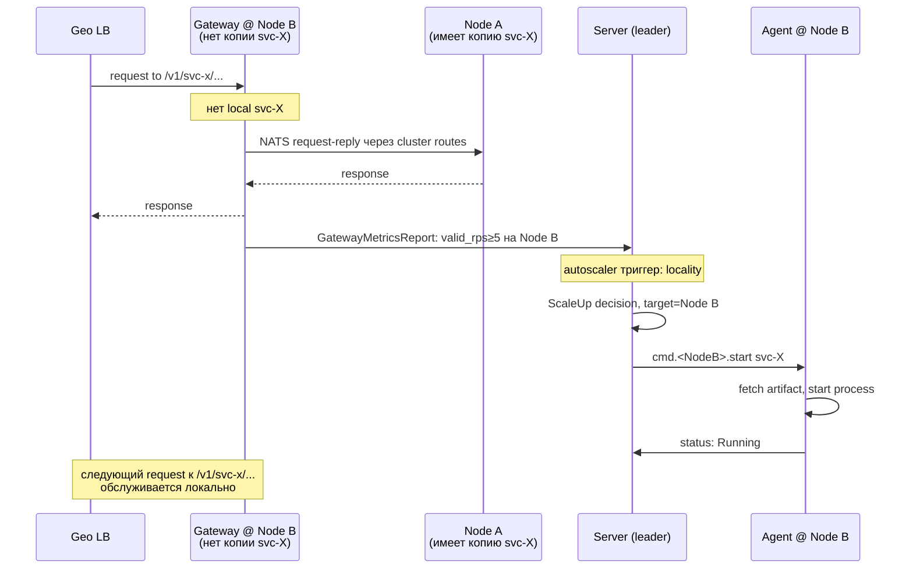
```mermaid
sequenceDiagram
    participant LB as Geo LB
    participant GW as Gateway @ Node B<br/>(нет копии svc-X)
    participant N as Node A<br/>(имеет копию svc-X)
    participant SRV as Server (leader)
    participant AGT_B as Agent @ Node B
    
    LB->>GW: request to /v1/svc-x/...
    Note over GW: нет local svc-X
    GW->>N: NATS request-reply через cluster routes
    N-->>GW: response
    GW-->>LB: response
    GW->>SRV: GatewayMetricsReport: valid_rps≥5 на Node B
    Note over SRV: autoscaler триггер: locality
    SRV->>SRV: ScaleUp decision, target=Node B
    SRV->>AGT_B: cmd.<NodeB>.start svc-X
    AGT_B->>AGT_B: fetch artifact, start process
    AGT_B->>SRV: status: Running
    Note over LB,GW: следующий request к /v1/svc-x/...<br/>обслуживается локально
```

### 11.4 Деплой v2 с откатом

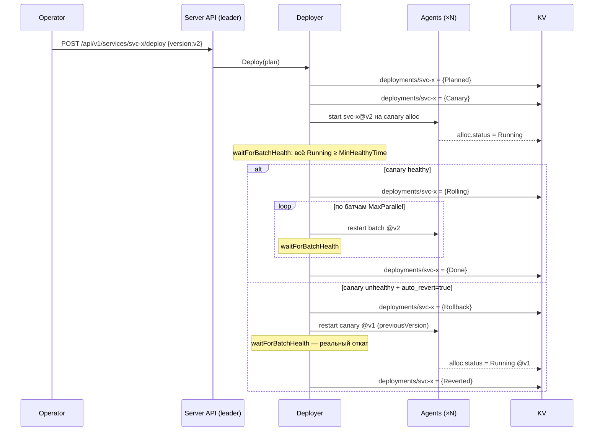
```mermaid
sequenceDiagram
    participant Op as Operator
    participant API as Server API (leader)
    participant DEP as Deployer
    participant AGT as Agents (×N)
    participant KV as KV
    
    Op->>API: POST /api/v1/services/svc-x/deploy {version:v2}
    API->>DEP: Deploy(plan)
    DEP->>KV: deployments/svc-x = {Planned}
    DEP->>KV: deployments/svc-x = {Canary}
    DEP->>AGT: start svc-x@v2 на canary alloc
    AGT-->>KV: alloc.status = Running
    Note over DEP: waitForBatchHealth: всё Running ≥ MinHealthyTime
    
    alt canary healthy
        DEP->>KV: deployments/svc-x = {Rolling}
        loop по батчам MaxParallel
            DEP->>AGT: restart batch @v2
            Note over DEP: waitForBatchHealth
        end
        DEP->>KV: deployments/svc-x = {Done}
    else canary unhealthy + auto_revert=true
        DEP->>KV: deployments/svc-x = {Rollback}
        DEP->>AGT: restart canary @v1 (previousVersion)
        Note over DEP: waitForBatchHealth — реальный откат
        AGT-->>KV: alloc.status = Running @v1
        DEP->>KV: deployments/svc-x = {Reverted}
    end
```

### 11.5 Drain узла

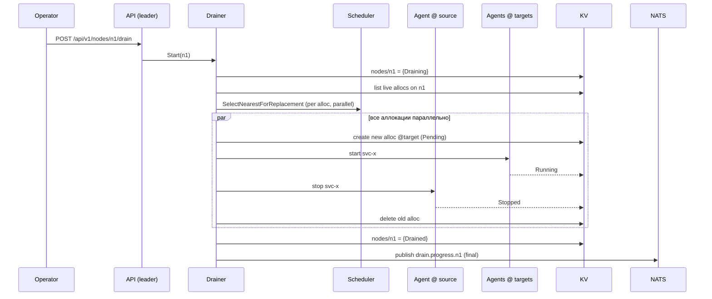
```mermaid
sequenceDiagram
    participant Op as Operator
    participant API as API (leader)
    participant DM as Drainer
    participant SCH as Scheduler
    participant AGT_src as Agent @ source
    participant AGT_tgt as Agents @ targets
    participant KV as KV
    
    Op->>API: POST /api/v1/nodes/n1/drain
    API->>DM: Start(n1)
    DM->>KV: nodes/n1 = {Draining}
    DM->>KV: list live allocs on n1
    DM->>SCH: SelectNearestForReplacement (per alloc, parallel)
    par все аллокации параллельно
        DM->>KV: create new alloc @target (Pending)
        DM->>AGT_tgt: start svc-x
        AGT_tgt-->>KV: Running
        DM->>AGT_src: stop svc-x
        AGT_src-->>KV: Stopped
        DM->>KV: delete old alloc
    end
    DM->>KV: nodes/n1 = {Drained}
    DM->>NATS: publish drain.progress.n1 (final)
```

### 11.6 Сжатие кластера на лету

Симметричный к §11.2 сценарий: оператор убирает узел из A-записи
(или `peers.txt`), узел получает SIGTERM, агент проводит graceful-
decommission, выживший кластер продолжает работать без cold restart
в standalone.

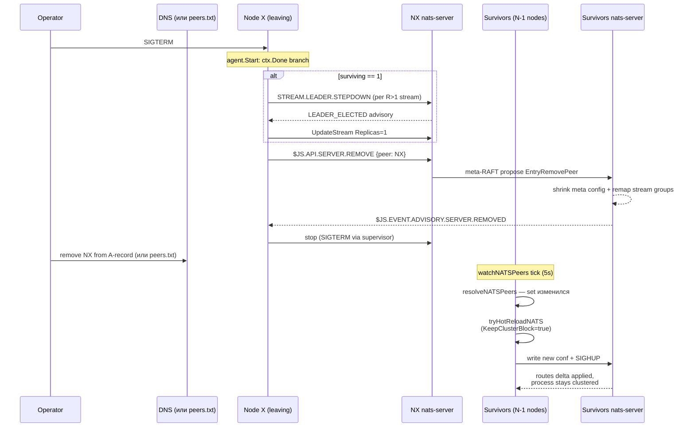
```mermaid
sequenceDiagram
    participant Op as Operator
    participant DNS as DNS (или peers.txt)
    participant NX as Node X (leaving)
    participant NXNATS as NX nats-server
    participant NS as Survivors (N-1 nodes)
    participant NSNATS as Survivors nats-server

    Op->>NX: SIGTERM
    Note over NX: agent.Start: ctx.Done branch
    alt surviving == 1
        NX->>NXNATS: STREAM.LEADER.STEPDOWN (per R>1 stream)
        NXNATS-->>NX: LEADER_ELECTED advisory
        NX->>NXNATS: UpdateStream Replicas=1
    end
    NX->>NXNATS: $JS.API.SERVER.REMOVE {peer: NX}
    NXNATS->>NSNATS: meta-RAFT propose EntryRemovePeer
    NSNATS-->>NSNATS: shrink meta config + remap stream groups
    NSNATS-->>NX: $JS.EVENT.ADVISORY.SERVER.REMOVED
    NX->>NXNATS: stop (SIGTERM via supervisor)
    Op->>DNS: remove NX from A-record (или peers.txt)
    Note over NS: watchNATSPeers tick (5s)
    NS->>NS: resolveNATSPeers — set изменился
    NS->>NS: tryHotReloadNATS<br/>(KeepClusterBlock=true)
    NS->>NSNATS: write new conf + SIGHUP
    NSNATS-->>NS: routes delta applied,<br/>process stays clustered
```

**Ключевые свойства:**

- `SERVER.REMOVE` шринкает meta-RAFT config — кворум остаётся
  достижимым для последующих proposal'ов.
- На переходе 2→1 уходящий узел понижает `Replicas` до 1 ДО
  `SERVER.REMOVE` (после disable JS UpdateStream уже не пройдёт).
- Выжившие НЕ переходят в standalone-mode: `tryHotReloadNATS`
  передаёт `KeepClusterBlock=true` в `natsconf.Render`, NATS на
  SIGHUP принимает `cluster{}` с пустыми routes.
- Без этого зашли бы в `10074: replicas > 1 not supported in
  non-clustered mode` при попытке загрузить ранее реплицированные
  стримы из дискового стора.

---

## 12. Идеальная файловая структура

```
asty/
├── cmd/
│   └── asty/
│       └── main.go                 # CLI entry; mode dispatch
├── internal/
│   ├── core/                       # L0 — нет внутренних зависимостей
│   │   ├── identity/               # NodeID/AllocID generators
│   │   ├── types/                  # все доменные типы и enum'ы
│   │   ├── errors/                 # типизованные ошибки
│   │   ├── codec/                  # codec.Wire/State, единственный switch
│   │   ├── config/                 # YAML + env, единственный точечный модуль
│   │   ├── natsconf/               # рендер nats.conf
│   │   └── netutil/                # connect/addrs/hostname
│   ├── infra/                      # L1 — обёртки внешних систем
│   │   ├── kv/                     # JetStream KV adapter + watchers
│   │   ├── natsd/                  # supervised nats-server child
│   │   ├── process/                # exec + monitor + log rotation
│   │   ├── artifact/               # fetch + sha256 verify + cache
│   │   └── probe/                  # HTTP/NATS health probes
│   ├── domain/                     # L2 — типы + FSM, без I/O
│   │   ├── allocation/             # AllocationStatus FSM, invariants
│   │   ├── service/                # ServiceDefinition + ParseDuration*
│   │   ├── node/                   # NodeStatus FSM, capacity model
│   │   ├── deployment/             # DeploymentPlan + DeploymentRecord + FSM
│   │   ├── drain/                  # DrainOp + progress model
│   │   └── proximity/              # Matrix + validation
│   ├── ops/                        # L3 — use cases (orchestration)
│   │   ├── leader/                 # election + watch
│   │   ├── reconciler/             # workqueue + reconcile pipeline
│   │   ├── scheduler/              # PickCandidates + helpers
│   │   ├── autoscaler/             # EvaluateService + Execute
│   │   ├── deployer/               # canary + rolling + REAL rollback
│   │   └── drainer/                # parallel migration
│   ├── api/                        # L4 — HTTP-границы
│   │   ├── rest/                   # /api/v1/*
│   │   ├── prom/                   # /metrics (collectors)
│   │   ├── stream/                 # SSE infrastructure
│   │   ├── gateway/                # /v1/* (user-facing)
│   │   └── health/                 # /health
│   ├── server/                     # composition root: -mode server
│   ├── agent/                      # composition root: -mode agent
│   └── testutil/                   # фикстуры и assertion-хелперы
├── deploy/                         # шаблоны конфигов
│   ├── dev/
│   │   ├── config.asty
│   │   ├── docker-compose.yml      # инфра (postgres только)
│   │   └── start.sh                # 1..N nodes, add, stop
│   └── prod/
│       └── config.asty
├── web/                            # SPA для control plane
│   ├── src/
│   ├── public/
│   ├── package.json
│   └── ...
└── docs/                           # человеко-читаемая документация
    └── README.md

# вне asty/:
demo/                               # клиентский бойлерплейт
├── cmd/                            # xauth, xhttp, xws
├── internal/
└── web/                            # клиентский UI к демо-сервисам
```

**Принципы файловой структуры:**

1. **Один пакет — одна ответственность**, не одна сущность. `allocation`
   содержит и `AllocationStatus`, и `ServiceAllocation`, и переходы FSM,
   но не имеет в себе I/O.
2. **`internal/*` — никакого re-export.** Если пакет нужен извне, он
   выходит из `internal/` или прячется за интерфейс на границе.
3. **composition roots тонкие.** `internal/server/server.go` собирает
   зависимости, но не содержит ни одного бизнес-условия. Любое `if
   alloc.Status == ...` в server-пакете — bug, перенести в domain или
   ops.
4. **doc.go в каждом пакете** с однострочной целью пакета. Никаких
   многоабзацных godoc — это работа отдельной документации.
5. **`testutil/` доступен только из тестов.** Не из прод-кода.
6. **`web/` — внутри `asty/`**, потому что control-plane UI часть
   продукта. Демо-UI лежит в `demo/web/`.

---

## 13. Тестирование

### 13.1 Слои и формат

| Слой | Что тестируется | Стиль |
|---|---|---|
| L0 (core) | чистые функции, типы | table-driven, без фикстур |
| L1 (infra) | адаптеры | с реальным NATS (`tests/integration`) или с in-memory fake |
| L2 (domain) | FSM-переходы, инварианты | property tests (gopter) |
| L3 (ops) | бизнес-логика | unit с stub'ами infra |
| L4 (api) | HTTP-форма ответов | httptest |

### 13.2 Mandatory checks

`make ci`:
1. `make build` — проверка компиляции под все целевые ОС.
2. `make vet` — `go vet ./...`.
3. `make race` — `go test -race -count=1 ./...`.
4. `make test-integration` — тег `integration`, требует runtime
   (embedded NATS, postgres).

CI обязан запускать все четыре на каждом PR.

### 13.3 Координаты тестов

- `*_test.go` рядом с тестируемым файлом (Go convention).
- `tests/integration/` — мульти-пакетные сценарии (drain end-to-end,
  deploy с rollback, расширение кластера на лету).
- `tests/property/` — property-тесты доменных FSM.

---

## 14. Стратегия миграции из текущего состояния

Текущая система описана в `.audit/AS_IS.md`. Миграция к ТЗ — поэтапная,
без big-bang переписывания. Каждый этап деплоится отдельно.

### Этап 1 — критические баги (без структурных изменений)

Никакой реорганизации файлов. Только правка поведения, описанного в
ТЗ как обязательное:

1. **Memory check в процентах**, не в MB. Изменение в `scale_up.go`
   + добавить `node.MemoryTotal` в расчёт. Тесты.
2. **`MaxParallel<=0` отвергается** на стадии `Validate` плана. Иначе
   обоснованный default (например, 1).
3. **`Canary` из `.asty`**, а не хардкод. Default 1, но конфигурируется.
4. **`auto_revert` действительно откатывает**. Реализовать
   `revertDeployment` так, чтобы он рестартовал allocs с
   `previousVersion`.

Срок: 2 недели.

### Этап 2 — наблюдаемость и API-разделение

5. **API split**: `/api/v1` для data, `/metrics` для Prom.
   Параллельно поддерживать старый `/metrics/*` data-роут с deprecation
   header'ом, чтобы web и CLI смогли мигрировать без даунтайма.
6. **Web-клиент обновить** до нового префикса.
7. После миграции UI — удалить старый `/metrics/*` data-роут.

Срок: 2 недели.

### Этап 3 — leader-only effects

8. **`POST` на followers редиректит** на лидера. Текущий код
   проверяет `IsLeader()` на конкретных endpoint'ах ad-hoc — заменить
   middleware'ом, единый источник правды.

Срок: 1 неделя.

### Этап 4 — рефактор слоёв

9. **Извлечь L2 (domain)** из `features/` и `core/types/`. Тщательно,
   с тестами для каждой FSM.
10. **Извлечь L1 (infra)** из `features/clustering/state/`,
    `features/execution/*`, `features/deployment/artifacts/`.
11. **L3 (ops)** — переименовать `features/` подпакеты в `ops/`,
    разорвать связи с `server`/`agent` через интерфейсы (`DrainDeps`-подобные).
12. **L4 (api)** — разнести `features/api/` на `api/rest`, `api/prom`,
    `api/stream`, `api/health`. `features/gateway/` → `api/gateway`.

Срок: 6 недель. Делается семьёй PR-ов, каждый небольшой, каждый
green-build.

### Этап 5 — параллельный drain и улучшенные FSM

13. **Drain параллельный** для regular-allocs.
14. **Allocation FSM**: добавить `Stopping`, `Restarting`.
15. **Node FSM**: добавить `Joining`, `Stale`.

Срок: 3 недели.

### Этап 6 — финальный hygiene

16. **Удалить out-of-config `os.Getenv`** в пользу полей `Config`.
17. **Удалить файлы >200 строк** (`agent.go`, `downloader.go`).
18. **Добавить `depguard`** в линтер, чтобы запретить нарушения слоёв
    на уровне CI.

Срок: 2 недели.

**Итого**: 16 недель (~4 месяца) при выделенной команде. На стороне
backward-compat — ничего не ломается: старые `.asty` файлы работают,
старые env-переменные продолжают читаться (с warning'ом), и старый
`/metrics/*` data-роут отдаёт `301` на новые после этапа 2.

---

## 15. Что осталось за пределами ТЗ

Намеренно не рассматривается:

- **Multi-region failover state replication** между географическими
  кластерами. JetStream KV — на один логический кластер. Кросс-регион
  — отдельная история (mirror streams, conflict resolution).
- **Persistent service state** за пределами KV. Если сервис нуждается
  в собственной БД — он подключается сам.
- **Identity bootstrap**: как получить `A_TOKEN` и `A_NATS_*_PASSWORD`
  на узел при первом запуске. Это задача внешнего provisioning
  (Terraform/Ansible/cloud-init).
- **TLS termination** для dashboard и gateway-листенеров. Делается
  front-proxy (Caddy / Traefik / nginx). Сам Asty слушает HTTP plain
  — это сознательное архитектурное решение, см. §10.
- **Per-operator accounts / RBAC.** Audit-event сейчас фиксирует
  только `actor_ip` без user-identity. Multi-user dashboard с
  ролями — отдельный ТЗ.

Эти участки могут стать темами для отдельных ТЗ.

В **scope** ТЗ и **реализовано** на ветке `migration/tz`:
- drop-root агента после bootstrap в выделенного `asty` (§10.3);
- audit log на `asty.v1.audit.*` (§10.5);
- token-auth + leader-only middleware на write-эндпоинтах (§10.4).
